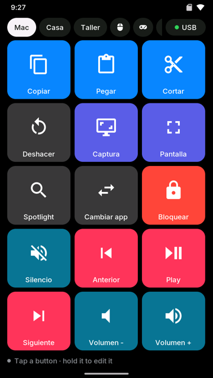
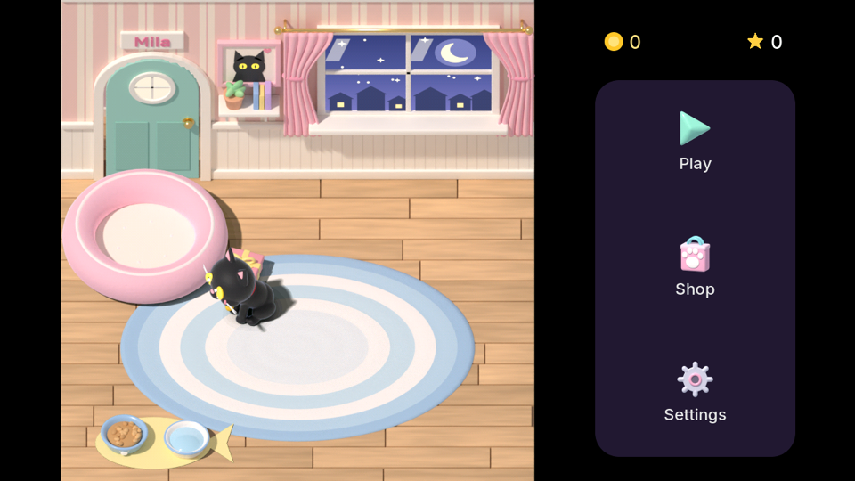
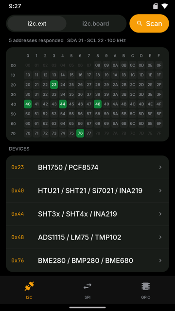
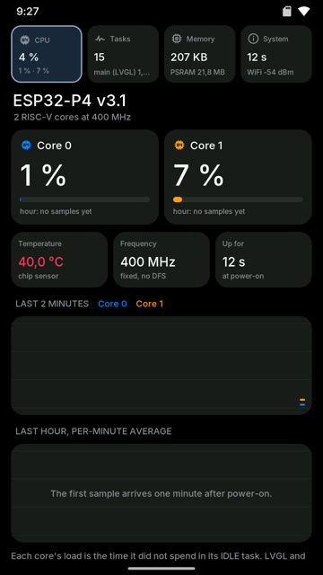

# P4OS

An iPhone-style operating system for the **Waveshare ESP32-P4-WIFI6-Touch-LCD-5**,
a 5" 720×1280 board with an ESP32-P4 (two RISC-V cores at 400 MHz, 32 MB of
PSRAM) and an ESP32-C6 that does its Wi-Fi.

It has a home screen with pages, folders and a dock, a control centre and
notifications, and runs in portrait or landscape. There are twenty-odd
built-in apps and thirty more loaded from the microSD as shared objects:
games with art rendered in Blender, Doom, a 3D viewer, a street map, video,
a Lua interpreter. It also has:

- a web portal;
- a USB port that is a keyboard, mouse, gamepad, MIDI device, network and
  disk to a computer;
- a Wi-Fi network of its own for when there is none;
- a workshop side for the 40-pin header: I2C, SPI, GPIO, a serial terminal,
  an ESP32 programmer, Modbus, a bench supply and a scope;
- a desktop simulator that runs the same UI code, so most of it can be built
  without the board.

It descends from [AmoledOS](https://github.com/charliejgallo/ESP32S3_AmoledOS), a
smartwatch firmware for a 1.8" board. The app model, the portal and many of
the apps came from there and were redrawn for a screen five times larger.

  
  
  

  

<em>Captures from the simulator, which draws the same
pixels as the board.</em>

---

## What it does

**The shell.** It has icon pages and folders, and a dock. Swiping down from
the top opens the control centre and the notifications. The status bar shows
the Wi-Fi, the card and the USB. The board has no accelerometer, so the
orientation is chosen in Settings or the control centre. Apps that only make
sense one way turn the screen while they are open.

**Built-in apps.** These are in the firmware:

| Group | Apps |
|---|---|
| Everyday | Settings, Files, Photos, Music, Clock (world clock, alarms, stopwatch, timer, pomodoro), Calendar, Calculator, Converter |
| Home | Home Assistant, MQTT, Claude (your plan's usage; unofficial, see [CLAUDE-APP.md](docs/CLAUDE-APP.md)) |
| Workshop | Bus (I2C, SPI, GPIO), Modules, Terminal, Programmer, Modbus, Bench (Riden supply and Rigol scope), Electronics calculators |
| System | Monitor (CPU, tasks, memory, temperature), Network tools, Macro pad |

**Apps from the card.** These are `.so` files loaded at boot, with their art
in packs:

| | |
|---|---|
| Games | Mila (Sokoban with a black cat, 3D in Blender), Monster Hop, Turbo, Golf, Chatarra (an RPG), Arkanos, Burbujas, Gemas, 2043, Claude Jump, Neon Snakes, Topos, Truco, Blackjack, Buscaminas, Simon, Flappy, Atasco, Dados, Claudito, Doom |
| Tools | Maps (vector, with offline zones), Radio (MP3, AAC, HLS), Cameras (RTSP and MJPEG), Video, Visor 3D, Pixel Art, Recorder, Tuner, Weather, Quotes, Lua |

  

**The web portal.** At `p4os.local` it has a file explorer, firmware updates
and the log, among other pages. The log includes the tail of the previous
boot, which survives a software restart. If the firmware panicked, its crash
dump is there too.

**Updates over the air.** The flash has two slots. An update is written into
the idle one and boots on trial. If the board restarts in the first 30 s,
the bootloader goes back to the previous image by itself. Settings, Update
shows both slots and can go back on purpose.

**USB.** The OTG port is high speed (480 Mbit/s) and has three modes, chosen
in Settings:

- **Keyboard and mouse:** keyboard, media keys, mouse, a gamepad and a MIDI
  keyboard for the computer. The Macro pad app drives them. The same mode
  also opens a network over the cable, so the portal answers at
  `192.168.7.1` with no Wi-Fi around (6.7 MB/s).
- **Disk:** the microSD appears on the computer as a USB drive. It comes back
  to the board when the computer ejects it.
- **Off.**

The mode is kept across restarts. [docs/USB.md](docs/USB.md) has the
descriptors and the three bugs it took to get them past macOS.

**Its own Wi-Fi.** Settings, Wi-Fi can bring up an access point
(`P4OS-XXXX`). It shows two QR codes: one joins the phone to it, the other
opens the portal at `192.168.4.1`. It works next to the home network, or
alone where there is none.

**The workshop.** The 40-pin rear header is described in `modules.txt`. Each
port (`i2c.ext`, `spi.a`, `uart.*`, GPIO) has an owner while an app uses it,
and Settings, Expansion draws the header with who holds each pin. Bus scans
I2C and names what answers, talks to SPI chips, and reads and drives GPIO.
The simulator has fake chips to try all of it without hardware
([docs/MODULES.md](docs/MODULES.md)).

  
  
  

**Languages.** The interface is written in Spanish and translated by
language packs on the card: English and German are complete, and a
pseudo-locale is used for testing layouts.

## The hardware

| | |
|---|---|
| Board | Waveshare ESP32-P4-WIFI6-Touch-LCD-5 (the model without a camera) |
| SoC | ESP32-P4, chip rev 1.3 here. Rev 3.x builds as a separate profile; a binary for one does not boot on the other |
| Display | 720×1280 MIPI-DSI (HX8394), GT911 touch with two fingers |
| Memory | 768 KB internal RAM, 32 MB PSRAM, 32 MB flash |
| Radio | ESP32-C6 over SDIO (esp_hosted 1.4): Wi-Fi 6 at 2.4 GHz. Bluetooth is not used yet, and ESP-NOW does not pass through |
| Other | microSD (4-bit), ES8311 + ES7210 audio, CH340 serial, RS485, USB 2.0 OTG, the BOOT button (home; long press: a screenshot; held during boot: safe mode) |

Internal RAM is the scarce resource. Since the audit of 2026-09-30, about
290 KB of it stays free with everything running. Almost everything else lives
in PSRAM: task stacks, LVGL's objects and buffers, lwIP's statics and the USB
buffers. [docs/MEMORY.md](docs/MEMORY.md) says what must stay internal and
why, and has every number.

## Building

You need ESP-IDF **v5.5** (the C6 link is validated on 5.5 with esp_hosted
1.4). [docs/BUILDING.md](docs/BUILDING.md) has the details.

    tools/build_fw.sh rev1_3                 # the firmware (or rev3_x)
    tools/build_apps.sh                      # every app in apps/, checked against that firmware
    cd sim && cmake -B build && cmake --build build -j8 && ./build/p4os_sim

The first flash goes over the CH340 port:

    tools/build_fw.sh rev1_3 -p /dev/cu.wchusbserial<id> flash

After that, updates go over the air:

    tools/ota.sh p4os.local

The simulator needs SDL2, mbedtls and ffmpeg (`brew install sdl2 mbedtls
ffmpeg`) and LVGL 9.5.0 in `sim/lvgl`. The firmware build has to have
run once first, because it fetches the components whose headers the
simulator shares.

## The card

    /apps/        <app>.so and <app>_p4.pak (the packs, from the release)
    /lang/        en/, de/ — the language packs (tools/install_lang.sh)
    /music/ /photos/ /videos/ /maps/
    menu.txt      the home screen's order and folders

[docs/APPS-P4.md](docs/APPS-P4.md) covers writing an app: the API, drawing a
frame of your own, and the frame rates measured per app.

## Status

Version **0.5.0**, the first public one: much of the base is done, and the
rest is listed below. [CHANGELOG.md](CHANGELOG.md) has what it contains.
It runs on the board every day. On the board itself:

- **Tested:** Wi-Fi (station and access point), the portal, OTA with
  rollback, the USB modes against a Mac, the microSD, audio out, the games
  and most of the tools above, SPI and I2C scans with nothing attached, and
  the BOOT button.
- **Waiting for hardware on the bench:** real I2C and SPI chips, the
  programmer against another ESP32, the cameras, and the Riden over TTL.
  The list is in
  [docs/plan/PRUEBAS-PLACA.md](docs/plan/PRUEBAS-PLACA.md) (Spanish).

Known gaps:

- **Bluetooth:** not done yet.
- **A rare hang after a software restart:** neither the network nor the USB
  comes back, and it needs a RESET. It is instrumented but not understood
  ([docs/BUILDING.md](docs/BUILDING.md)).
- **Settings, Developer:** planned.

## Documentation

| | |
|---|---|
| [BUILDING.md](docs/BUILDING.md) | building, flashing, OTA, crash dumps, the watchdogs |
| [MEMORY.md](docs/MEMORY.md) | internal RAM vs PSRAM, the panel's three frame buffers, PSRAM bandwidth, the audit |
| [APPS-P4.md](docs/APPS-P4.md) | writing and installing `.so` apps, drawing a frame, measured fps |
| [USB.md](docs/USB.md) | the OTG port's modes, descriptors and measurements |
| [MODULES.md](docs/MODULES.md) | the 40-pin header, `modules.txt`, I2C/SPI/GPIO from apps |
| [MACROPAD.md](docs/MACROPAD.md) | the macro pad: pages, buttons, the gamepad and MIDI faces |
| [CAMERAS.md](docs/CAMERAS.md) | RTSP and MJPEG cameras on this board |
| [HOME-ASSISTANT.md](docs/HOME-ASSISTANT.md), [MQTT.md](docs/MQTT.md), [CLAUDE-APP.md](docs/CLAUDE-APP.md) | the home and service apps |
| [BENCH.md](docs/BENCH.md), [RETRO.md](docs/RETRO.md) | the hardware bench and the retro canvas |
| [docs/plan/](docs/plan) | the plan, the hardware survey, the UI and the expansion header (Spanish) |

## Names and marks

Claude and the Claude Code character belong to Anthropic. The Claude app,
Claudito and Claude Jump are an unofficial homage, made with affection for
the character, and are not affiliated with or endorsed by Anthropic. Doom is
id Software's, and Home Assistant is its owners'. The other products named
in the apps belong to their owners too.

## Licence

MIT, see [LICENSE](LICENSE). Third-party code, fonts, icons and data keep
their own licences; [THIRD-PARTY.md](THIRD-PARTY.md) lists each one and what
it asks for. `apps/doom/` is Chocolate Doom through doomgeneric, under the
GNU GPL v2, and no WAD is included.

## En castellano

P4OS es un sistema tipo iPhone para la placa de 5" de Waveshare con ESP32-P4.
La interfaz está escrita en castellano y se traduce con los paquetes de
idioma de la tarjeta. Los documentos del plan y de las pruebas en la placa
(`docs/plan/`) están en castellano; el resto, en inglés.

| | |
|---|---|
| Qué hace | inicio con carpetas, 20 apps propias y 30 de la tarjeta, portal web, USB como teclado/mouse/disco, red Wi-Fi propia con QR, taller con I2C/SPI/GPIO |
| Cómo se compila | ESP-IDF 5.5, `tools/build_fw.sh rev1_3`, `tools/build_apps.sh` |
| Cómo se instala | la primera vez por el CH340; después `tools/ota.sh p4os.local` o el portal |
| Qué falta | Bluetooth, probar chips reales en el conector, un cuelgue raro tras reiniciar |
