# P4OS

An iPhone-style operating system for the
[**Waveshare ESP32-P4-WIFI6-Touch-LCD-5**](https://www.waveshare.com/esp32-p4-wifi6-touch-lcd-5.htm)
([wiki](https://docs.waveshare.com/ESP32-P4-WIFI6-Touch-LCD-5)). It is a 5"
720×1280 touch board with an ESP32-P4 (two RISC-V cores at 400 MHz and
32 MB of PSRAM) and an ESP32-C6 that does the Wi-Fi.

It has a home screen with pages, folders and a dock, a control centre and
notifications, and a lock screen with an optional code, and it runs in
portrait or landscape. There are twenty-three built-in apps and thirty-eight more on
the microSD, loaded as shared objects:

- **Games:** twenty-one, among them Mila (a Sokoban with a black cat in
  Blender 3D), Monster Hop, a racing game, golf, a robot RPG, and Doom at
  35 fps.
- **Tools:** notes with task lists, a street map with offline zones,
  internet radio, IP cameras, video, a 3D viewer, a tuner, a drawing app,
  a VNC viewer for a computer's screen, and Lua.
- **A web portal** for files, updates, the log and the network sweeps, and a
  page for every app that wants one, which the app brings from the card.
- **Bluetooth with the phone:** the iPhone's notifications on the board, in
  colour emoji, its music, and its calls answered or rejected from the
  board; and the board as a computer's wireless keyboard and mouse.
- **USB:** the port becomes a keyboard, mouse, gamepad, MIDI device, network
  or disk for a computer; and the board is a USB host on its 40-pin header,
  two ports at once: pendrives, keyboards, mice, gamepads, webcams, sound
  cards, MIDI and serial devices.
- **A Wi-Fi network of its own,** joined with a QR code.
- **The workshop:** I2C, SPI, 1-Wire and GPIO on the 40-pin header,
  addressable LED strips on any free pin (WLED's way), a serial terminal, an
  ESP32 programmer, Modbus, a bench supply and scope, an EEPROM reader and
  writer, a PWM and servo generator with an analog level, a learning
  infrared remote with SmartIR's codes, and a CAN bus analyser. Each one
  was tried on the bench with real parts, wiring diagrams and photos
  included.
- **A software radio:** an RTL-SDR stick on the USB host gives a live
  spectrum and waterfall, broadcast FM in stereo, AM for the airband and
  narrow FM for hams and PMR, and the 433/868 MHz remotes and weather
  sensors decoded, with recordings of all of it and a page in the portal.

A desktop simulator runs the same UI code, so most of it can be built and
tried without the board.

It descends from [AmoledOS](https://github.com/charliejgallo/ESP32S3_AmoledOS),
a smartwatch firmware for a 1.8" board. The app model, the portal and many
of the apps came from there, redrawn for a screen five times larger.

  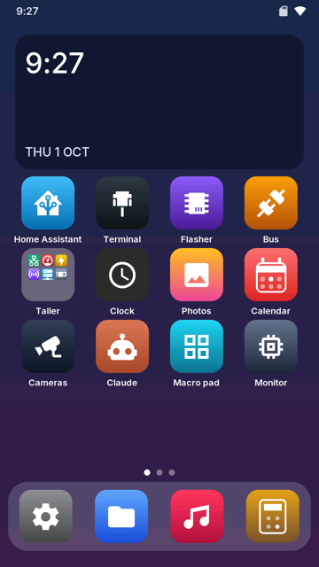
  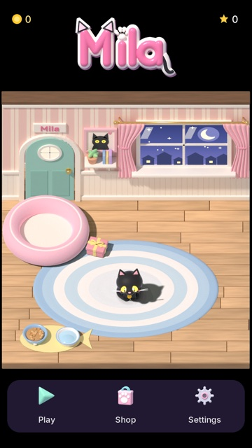
  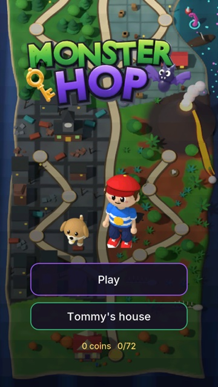

  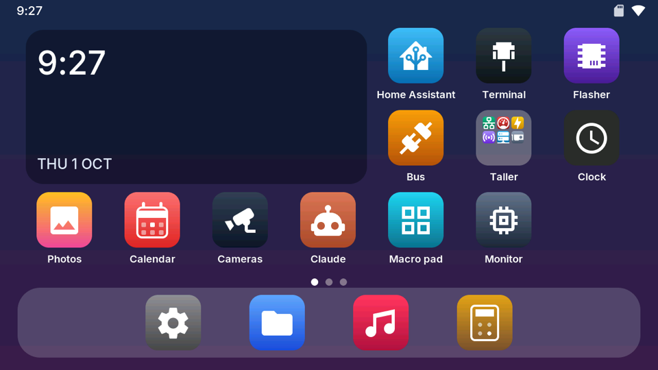

<em>The captures come from the simulator, which draws the
same pixels as the board.</em>

  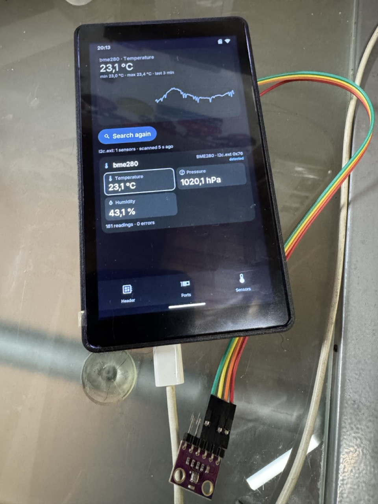
  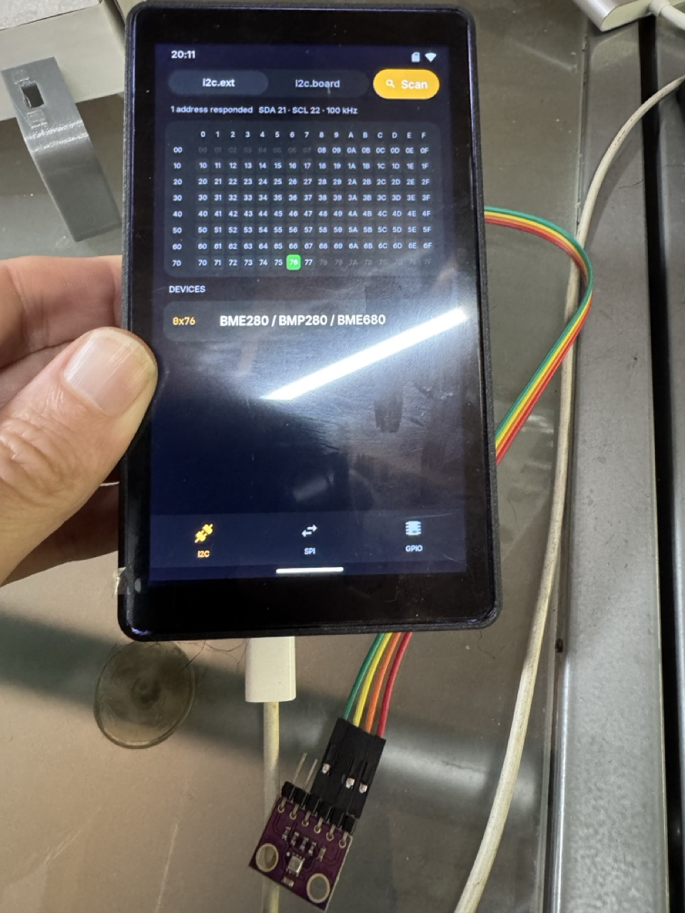
  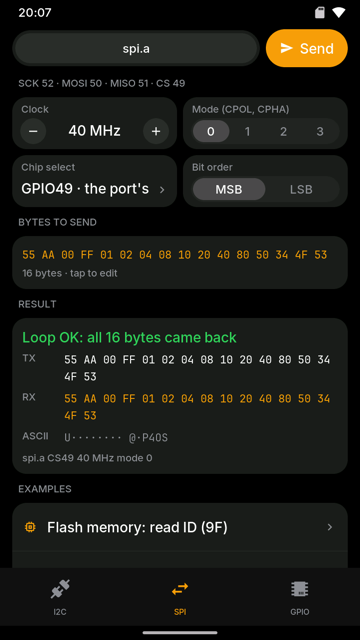

<em>And on the board: a BME280 on the rear header, found by
itself in Modules and by the scan in Bus, and the SPI loopback at 40 MHz
(that one is a capture from the panel, over HTTP).</em>

---

## What it does

### The shell

The home screen has icon pages, folders, a dock and widgets.

- **Swiping down** from the top opens the control centre (Wi-Fi, Bluetooth,
  do not disturb, orientation, brightness, volume, the music playing on the
  board or on the iPhone) and the notifications, with the phone's own
  actions.
- **The status bar** shows the Wi-Fi or the board's own network, the card
  and the USB.
- **The orientation** is chosen in Settings or the control centre, because
  the board has no accelerometer. Apps that only make sense one way turn the
  screen while they are open.
- **The BOOT button** goes home with a tap and takes a screenshot with a long
  press; screenshots go to an album in Photos. Held during the boot screen,
  it starts in safe mode, without the card's apps.

| Settings in landscape | Macro pad | Photos |
|---|---|---|
| 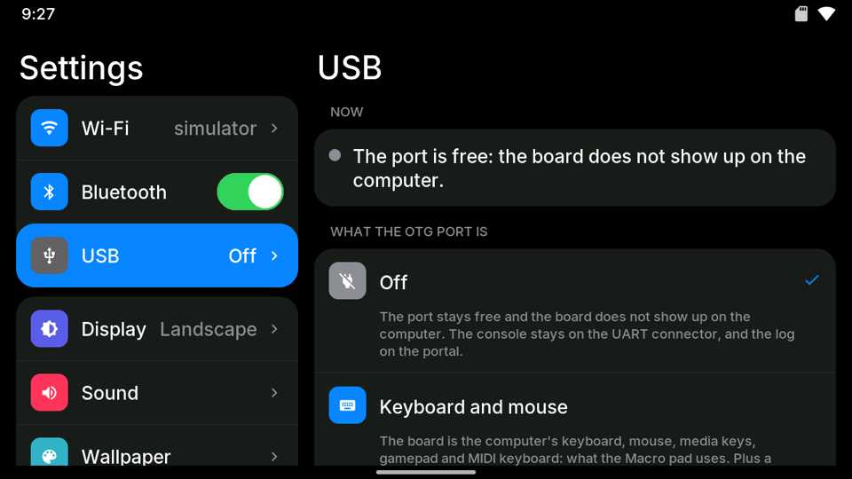 | 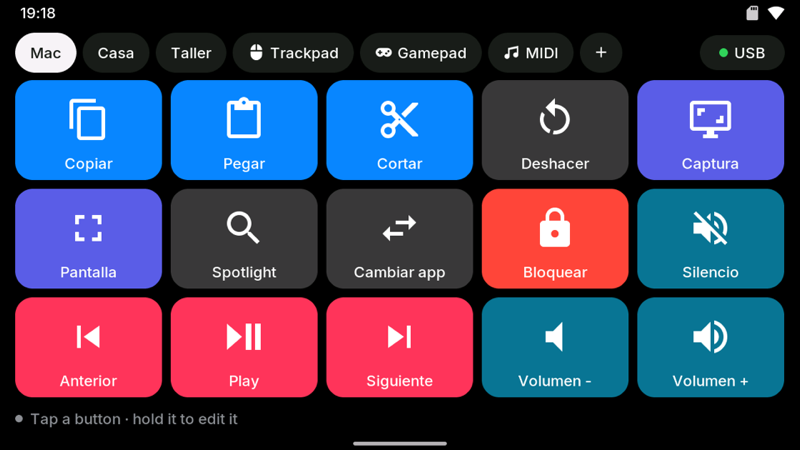 | 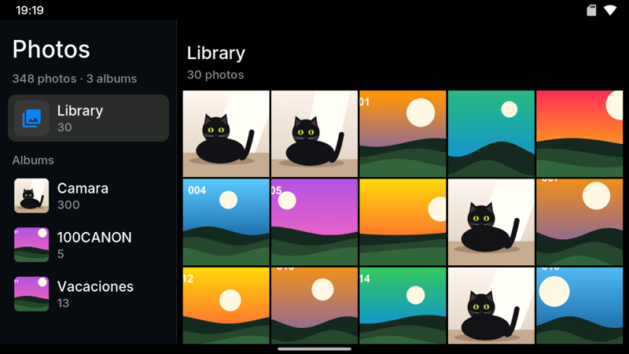 |

### The lock screen

It shows the time and date large, the messages that came in, and the music
playing with its buttons, over the wallpaper. To unlock, swipe up from
anywhere: the screen follows the finger.

- **When it locks:** at boot, and when the screen has been off for the time
  chosen in Settings (as soon as it goes off, or 1, 5, 15 or 60 minutes
  later). It is checked while the screen is still dark, so waking never
  shows a frame of what was under it.
- **An optional code** of 4 or 6 digits. It is kept as a salted SHA-256,
  never as itself. After 5 wrong tries the pad waits 30 s, and twice as long
  every 3 more; the count survives a restart.
- **A forgotten code:** in the BOOT button's safe mode the lock screen
  does not ask for it, and Settings can remove it.
- **Messages:** today the apps' notifications; the phone's over Bluetooth and
  Home Assistant's will arrive in the same list. With a code, their text can
  stay hidden until unlocked.

| Locked | The code | Settings, Wi-Fi: its own network |
|---|---|---|
| 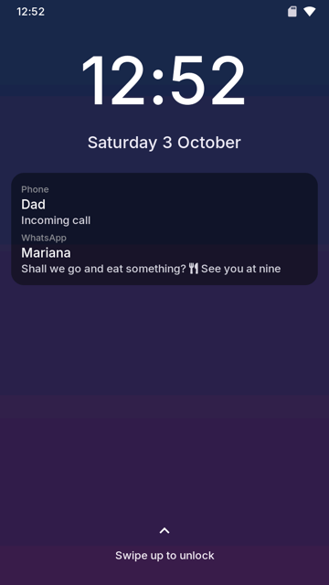 | 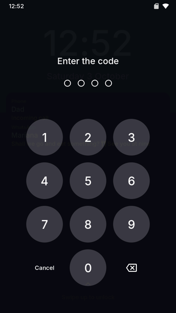 | 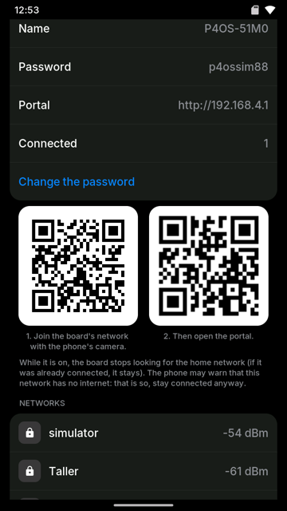 |

The gesture is a free swipe up, as phones do it today, and not a control
dragged along a track: Apple's 2005 patent on the latter
([US 7,657,849](https://patents.google.com/patent/US7657849B2)) expired in
2025, but that is not the reason this one was chosen.

### Built-in apps

Every day:

| Files | Photos | Music | Clock | Calendar |
|---|---|---|---|---|
| 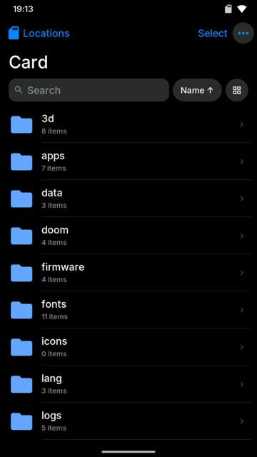 | 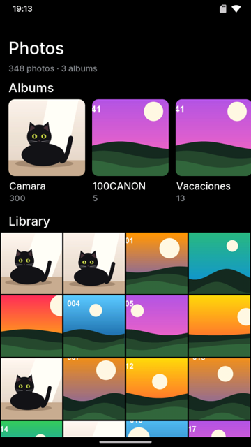 | 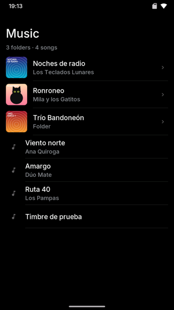 | 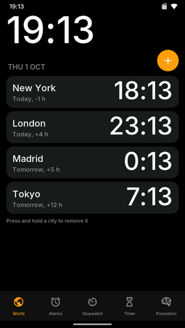 | 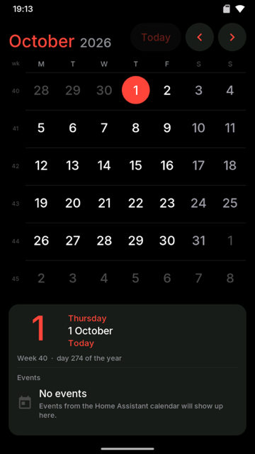 |

| Calculator | Converter | Home Assistant | Claude | Monitor |
|---|---|---|---|---|
| 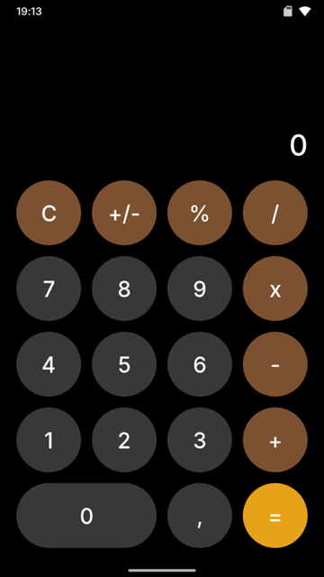 | 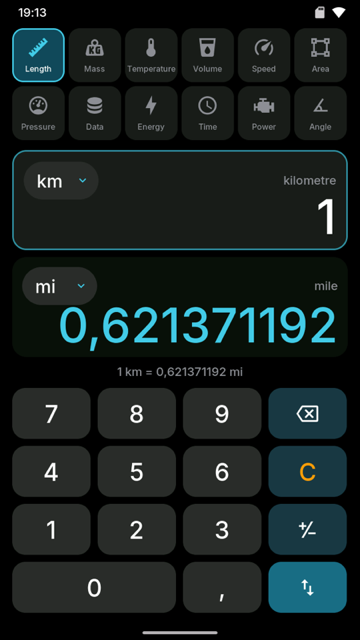 | 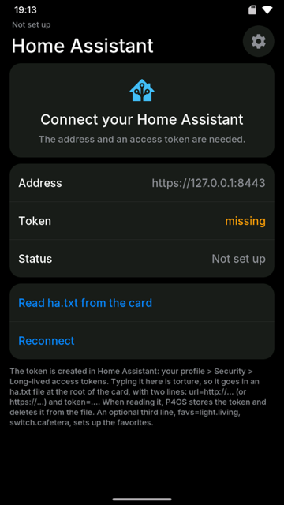 | 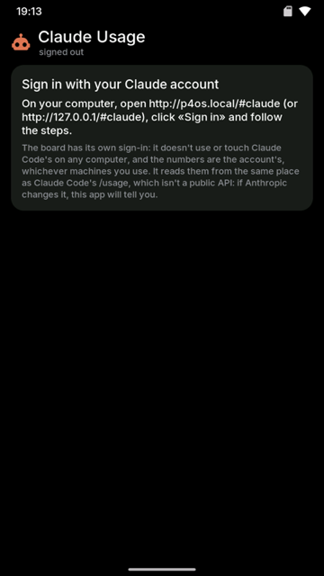 | 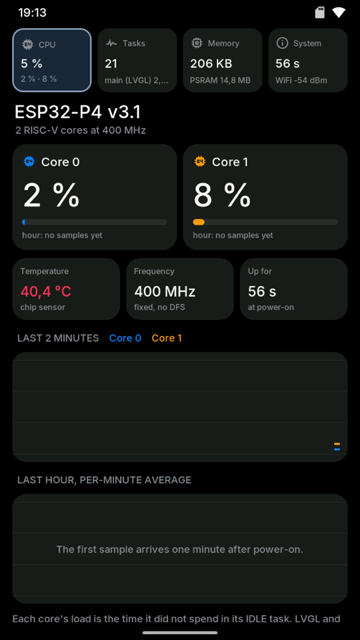 |

- **Files:** the card's explorer, with search, copy, move and folders, and
  firmware opened straight in the Programmer.
- **Photos:** albums, the screenshots among them.
- **Music:** MP3, gapless, with the covers.
- **Clock:** world clock, alarms, stopwatch, timer and pomodoro.
- **Home Assistant:** favourites and the calendar, over its WebSocket API.
- **Claude:** the usage of your own Claude plan, the numbers Claude Code's
  `/usage` shows. It is unofficial; see [CLAUDE-APP.md](docs/CLAUDE-APP.md).
- **Monitor:** CPU per core, the tasks, memory, temperature and the network.
- **Also built in:** MQTT, network tools (ping, a host and port scan with
  every MAC and its maker, mDNS, Wi-Fi; each sweep is saved, and the portal
  compares it with the one before) and Conway's Life.

### The workshop

The 40-pin rear header is described in `modules.txt`: which pins make each
port (`i2c.ext`, `spi.a`, `uart.*`, GPIO) and which modules hang from them.
While an app uses a port it owns it, and Settings, Expansion draws the
header with who holds each pin.

| Bus (I2C scan) | Modules | Terminal | Programmer | Modbus | Electronics |
|---|---|---|---|---|---|
|  | 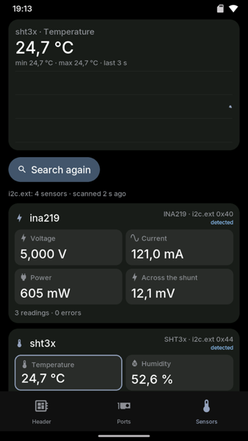 | 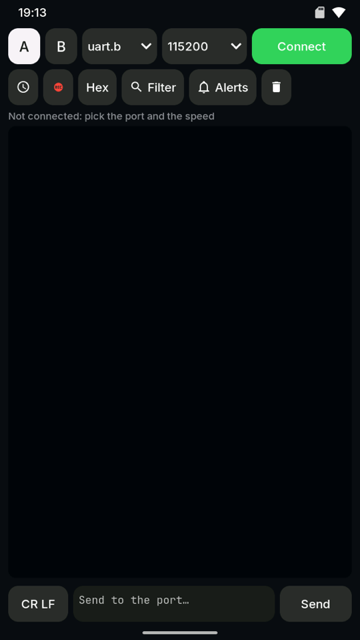 | 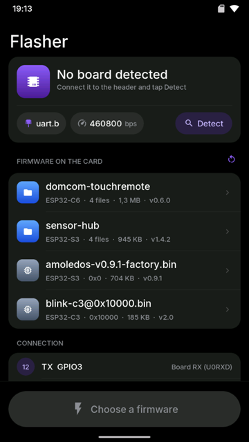 | 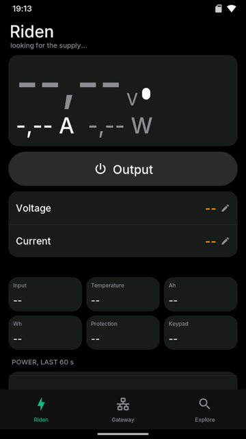 | 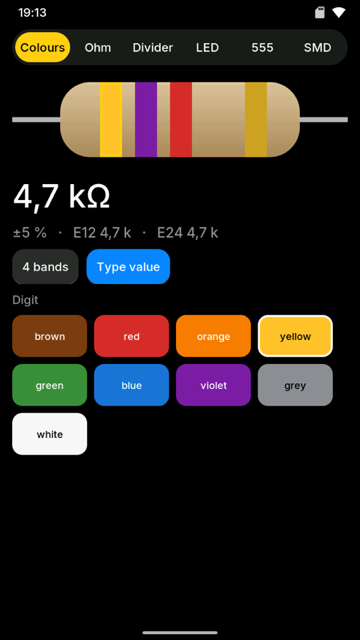 |

- **Bus:** scans I2C and names what answers, talks to SPI chips with presets
  (flash memories, the MAX31855, the MCP3008, the RC522 RFID reader, a
  loopback), finds the DS18B20s on a 1-Wire bus and reads them live with
  their resolution, and reads and drives GPIO.
- **LED Strips:** an addressable strip (WS2812B, WS2811, SK6812, SK6812 RGBW)
  on any free pin of the header, with the colour order and the number of
  LEDs. It has 13 effects with speed, intensity and two colours. The power
  tab estimates what the strip draws, WLED's way, and dims the whole frame to
  stay within the supply's budget. The strip keeps running with the app
  closed and comes back after a restart.
- **Modules:** live readings from the sensors in `modules.txt` (SHT3x,
  INA219, BME280...).
- **Terminal:** two serial ports, hex, filters and alerts.
- **Programmer:** flashes another ESP32 from firmware on the card
  (esp-serial-flasher), wired to the header or plugged into the USB host
  (a dev board goes into its bootloader by itself, through RTS and DTR).
- **Modbus:** a Riden RD60xx supply over RTU, and a gateway.
- **Bench:** a Rigol scope over the LAN, the Riden, a UNI-T generator over
  USB, and a logger to CSV.
- **Electronics:** resistor colours, Ohm's law, dividers, LEDs, the 555 and
  SMD codes.

The simulator has fake chips and fake servers for all of it, two DS18B20s on
its fake 1-Wire bus among them ([docs/MODULES.md](docs/MODULES.md)).

| LED Strips: effects | The strip | Power | Bus: 1-Wire |
|---|---|---|---|
| 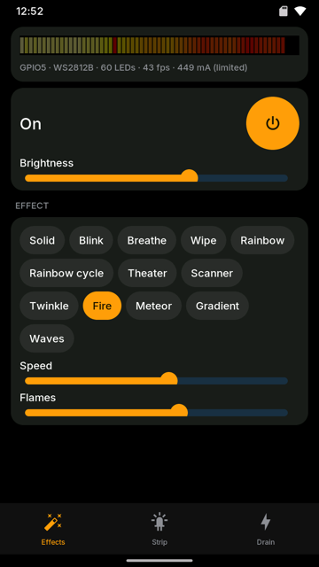 | 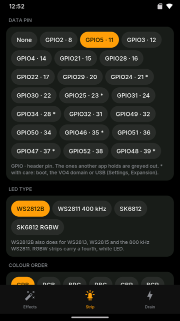 | 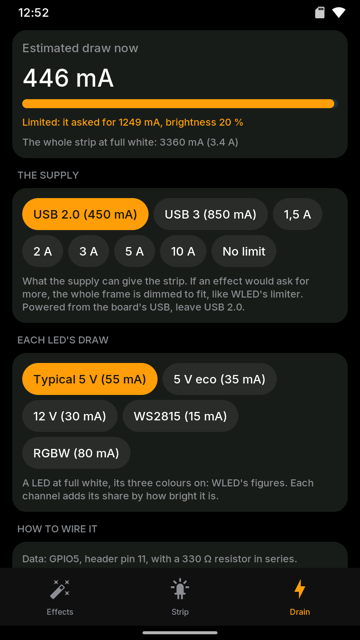 | 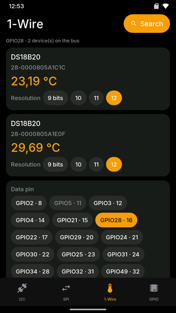 |

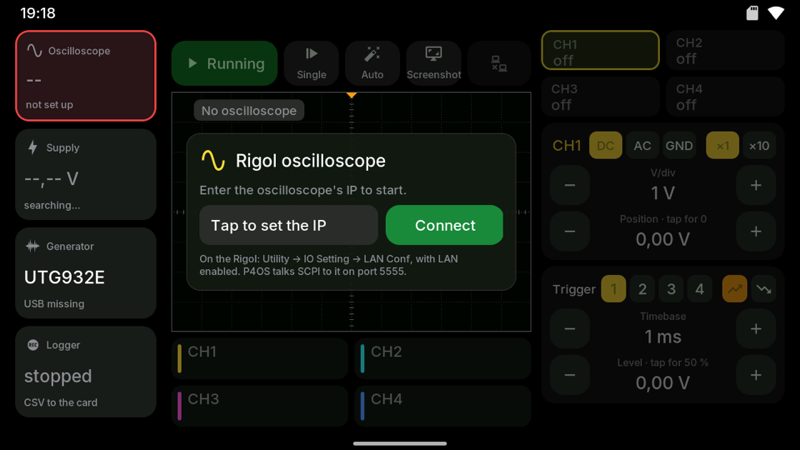

**From the card, for the bench** (since 0.10). Each one owns the header
pins it uses, has a wiring drawing on the board and a page in the portal.

| EEPROM | PWM | Infrared | CAN |
|---|---|---|---|
| 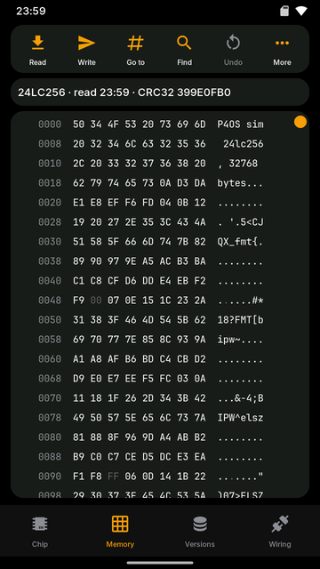 | 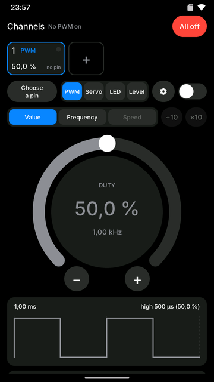 | 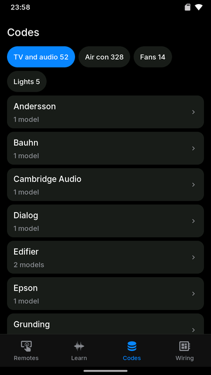 | 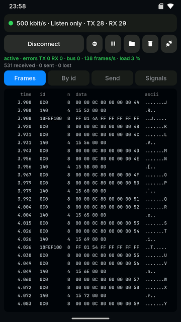 |

- **EEPROM:** reads, writes and edits serial memories: 24xx on I2C, 25xx
  and 25Qxx flash on SPI, 93xx Microwire. It finds the chip and measures
  its size, has a hex editor with find and undo, keeps versions with CRC32
  and MD5, compares them, and draws the wiring for the chosen chip.
- **PWM:** seven channels on any free pins, from 1 Hz to 20 MHz, with a
  knob, patterns (ramp, breathing, strobe, sine), servo pulses in
  microseconds, and an analog level through an RC filter (the P4 has no
  DAC).
- **Infrared:** learns a remote's buttons (NEC, Samsung, Sony, JVC,
  Panasonic, RC5, RC6, or raw) and sends them back; air conditioners, TVs, fans and lights
  from [SmartIR](https://github.com/litinoveweedle/SmartIR)'s code library.
- **CAN:** a bus analyser on the P4's TWAI controller: frames live, by id,
  sending, decoding signals, and recording to the card. It needs a 3.3 V
  transceiver (SN65HVD230); its self test needs none.

Tried on the bench on 2026-10-05: PWM at three frequencies at once with a
servo and the analog level checked with a meter (1.34 V asked, 1.313 V
measured), a WS2812B strip straight from 3.3 V, a monitor's remote learned
and sent back, and a 24LC256 read, edited, written and restored with its
checksums matching on a computer. The wiring drawings and the numbers are
in [docs/MODULES.md](docs/MODULES.md).

  
  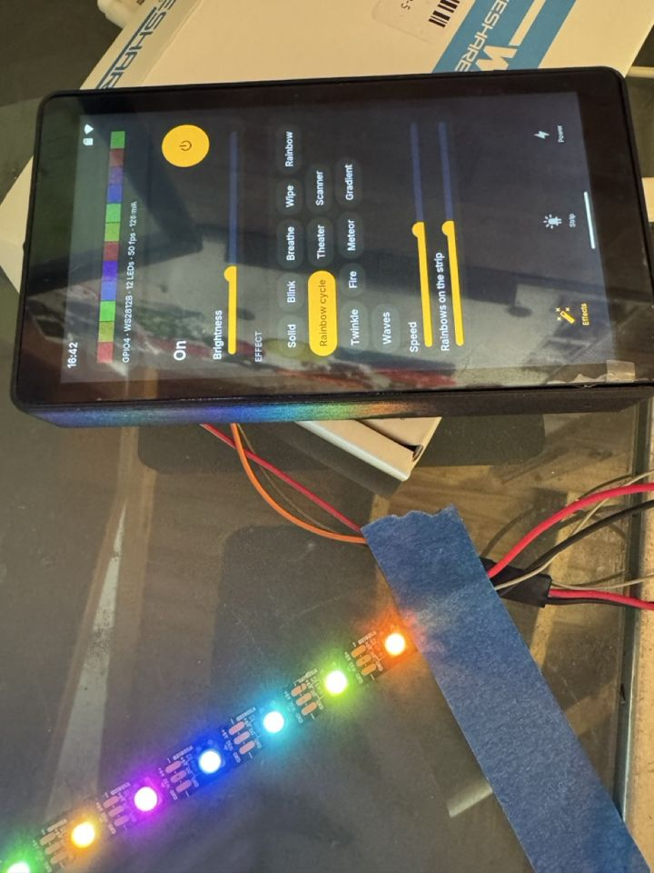
  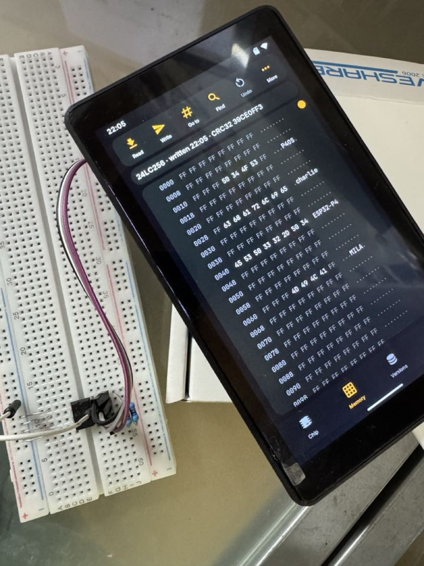

  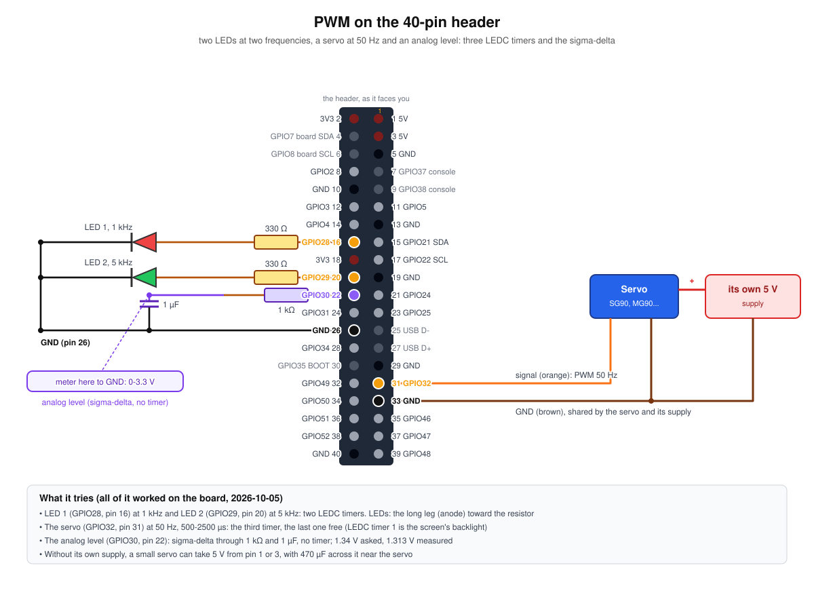

### RF, a software radio

An [RTL-SDR](https://www.rtl-sdr.com/about-rtl-sdr/) stick (an RTL2832U with
any of the tuners osmocom's library knows, the RTL-SDR Blog V4 included)
plugged into the USB host, with the driver inside the app: the firmware only lends
it raw USB access, so another receiver is another source file in the app
and no firmware ([apps/rf/README.md](apps/rf/README.md)). From the card,
since 0.11.

| FM, listening | 433 MHz, Data mode | A sensor's details |
|---|---|---|
| 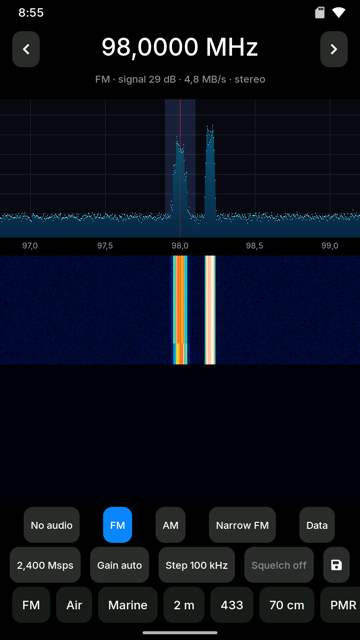 | 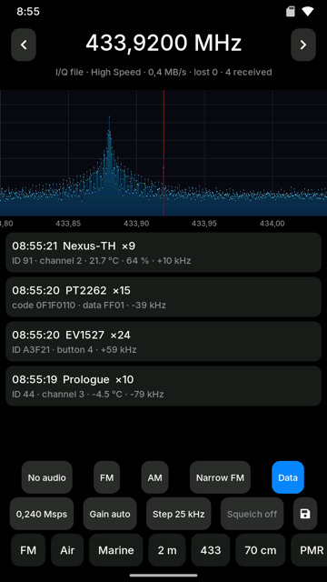 | 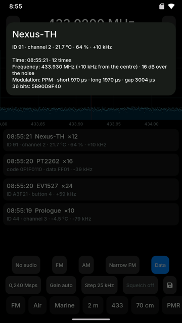 |

- **Spectrum and waterfall,** up to 2.4 Msps with none lost, drawn
  straight to the panel. Drag to tune, tap a frequency to centre it, or
  type one; a row of bands (FM, airband, marine, 2 m, 433, 70 cm, PMR).
- **Listening:** broadcast FM (mono, with the stereo pilot shown), AM for the
  airband, narrow FM for hams and PMR, with squelch over the measured
  noise floor. The filters are 16-bit fixed point on the P4's SIMD
  (esp-dsp), at about a third of one core.
- **Data:** the on-off keyed signals of 433/868 MHz remotes and sensors
  found in the band, their pulses analysed (PWM, PPM, Manchester) and
  decoded: EV1527 and PT2262 remotes, Nexus and Prologue thermometers;
  anything else shows its timings and bits.
- **Keeping it:** a screenshot, the audio as WAV,
  the raw signal as I/Q (and played back later as if live), what was
  received as CSV, and over MQTT.
- **Its page in the portal:** the spectrum and waterfall live, tuning and
  every control, the received list, the spectrum as PNG, and the
  recordings to download.

`librtlsdr` is GPL v2, so `rf.so` is too; the firmware stays MIT
([THIRD-PARTY.md](THIRD-PARTY.md)).

### Apps from the card

These are `.so` files that the firmware loads at boot. Their code runs
straight from PSRAM (on the P4, data and instructions share its addresses),
and their art comes in packs.

| Mila | Monster Hop | Turbo | Golf | Chatarra | Arkanos |
|---|---|---|---|---|---|
|  |  | 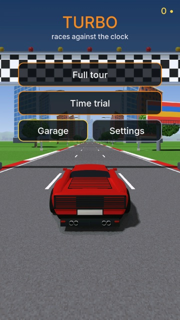 | 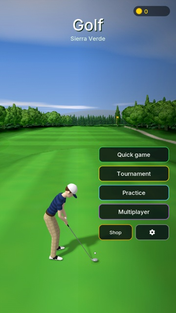 | 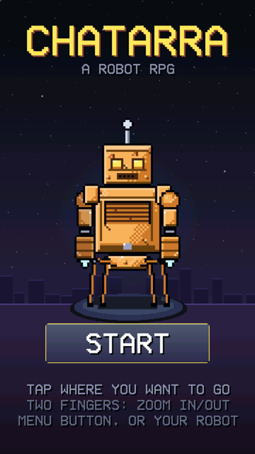 | 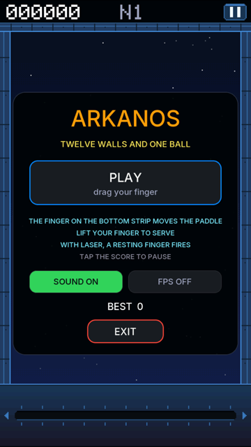 |

| Bubbles | Gems | 2043 | Claude Jump | Neon Snakes | Whack-a-Mole |
|---|---|---|---|---|---|
| 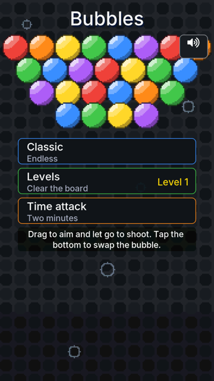 | 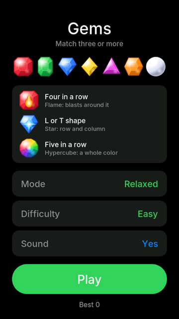 | 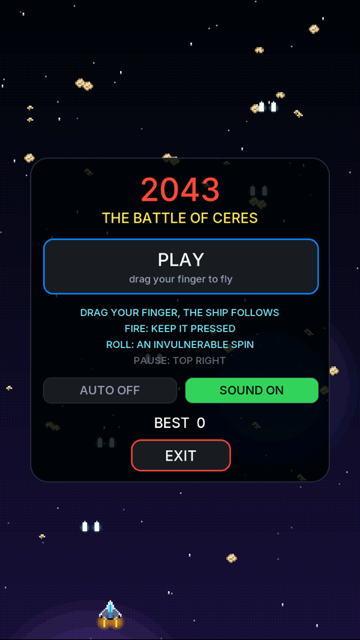 | 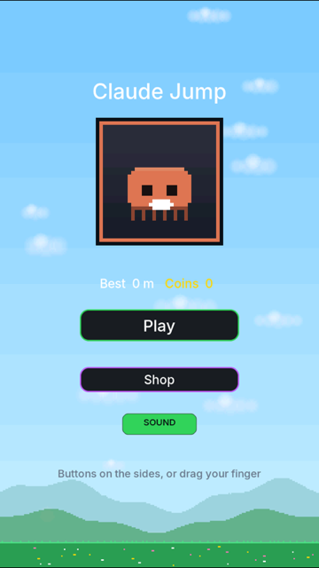 | 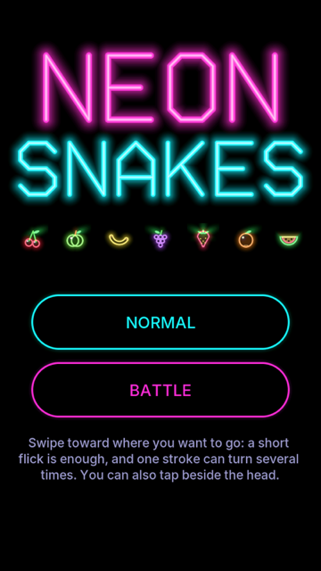 | 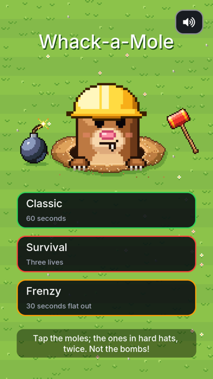 |

| Truco | Blackjack | Minesweeper | Simon | Traffic Jam | Claudito |
|---|---|---|---|---|---|
| 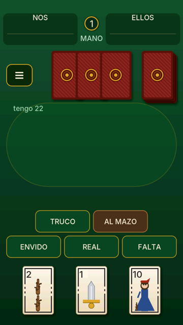 | 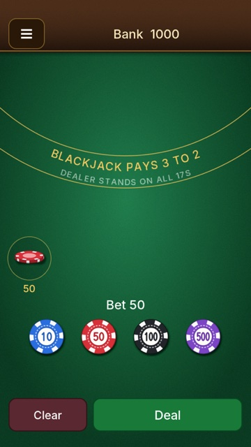 | 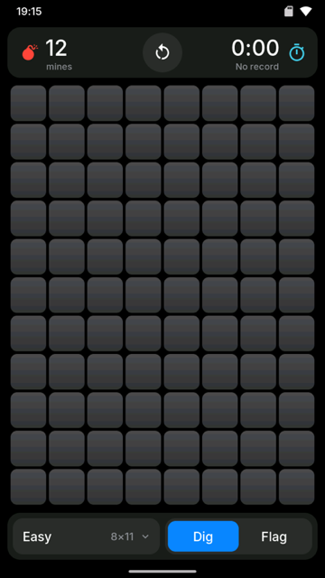 | 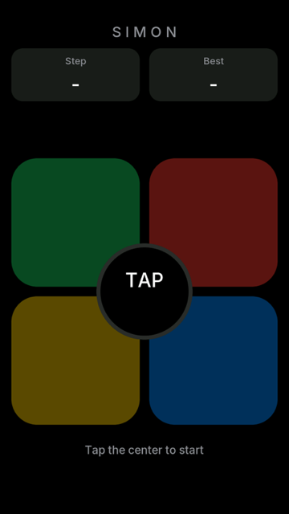 | 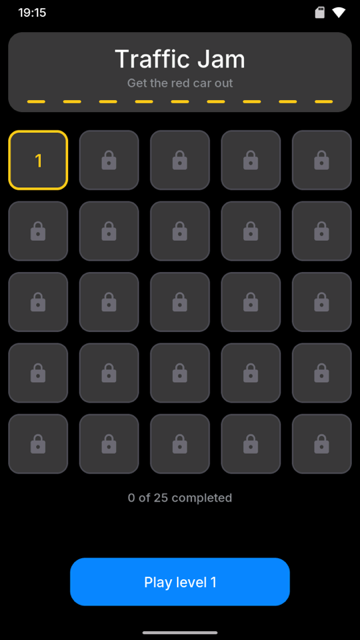 | 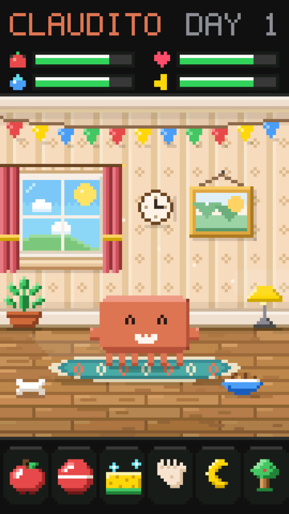 |

There are also Flappy, Dice, and Doom (doomgeneric, with OPL2 music). Doom
needs a WAD of your own, and none is included.

| Maps | Radio | Video | 3D Viewer | Pixel Art | Tuner |
|---|---|---|---|---|---|
| 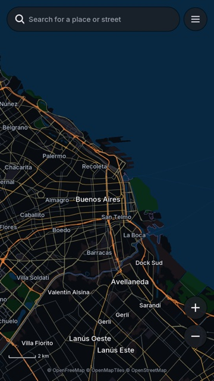 | 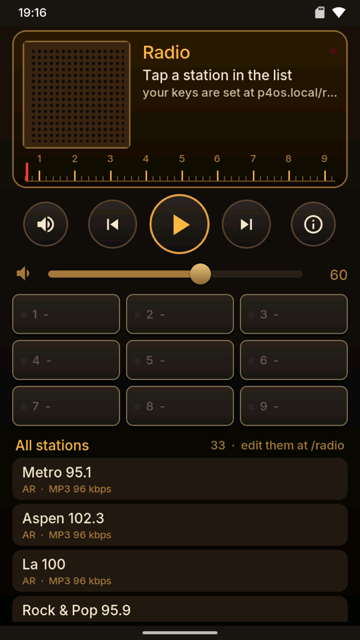 | 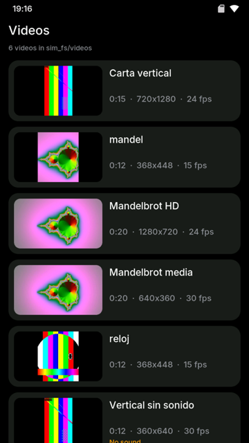 | 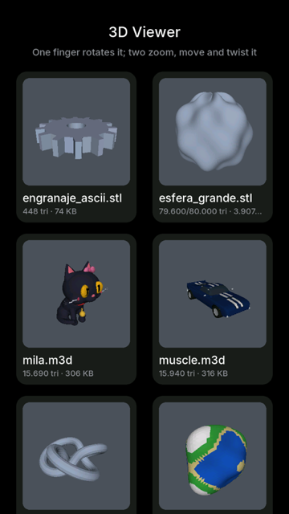 | 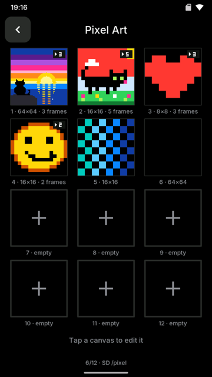 | 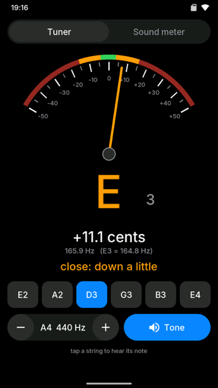 |

- **Maps:** OpenFreeMap vector tiles, drawn on the board, with offline zones
  made in the portal and place search.
- **Radio:** MP3, AAC and HLS stations, with a dial.
- **Video:** MJPEG + WAV from the card, up to 1280×720.
- **3D Viewer:** STL and the games' models, with up to 100 000 triangles.
- **Notes:** rich text (sizes, styles, colours, headings, bullets) and task
  lists with priorities and subtasks, one Markdown file per note.
- **Drawing:** layers, brushes, shapes, text, fill and selections, by
  finger or USB mouse, saved as PNG.
- **VNC:** a computer's screen on the board (a Mac's Screen Sharing with
  the VNC password, or any VNC server), driven by touch, as a trackpad, or
  with a USB mouse and keyboard; a keyboard bubble that floats over the
  remote screen, and one monitor of several marked with a finger.
- **Also from the card:** Cameras (RTSP H.264 and MJPEG), Recorder, Weather,
  Quotes, and Lua, where a script on the card is an app.

| Drawing | VNC, in landscape |
|---|---|
| 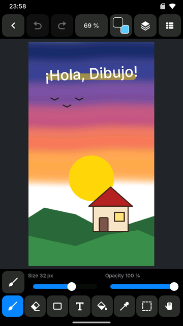 | 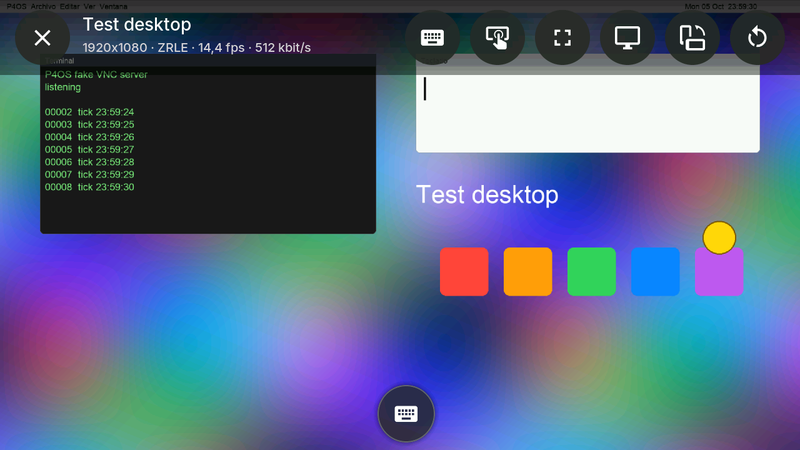 |

| Golf | Monster Hop | Maps | Turbo |
|---|---|---|---|
| 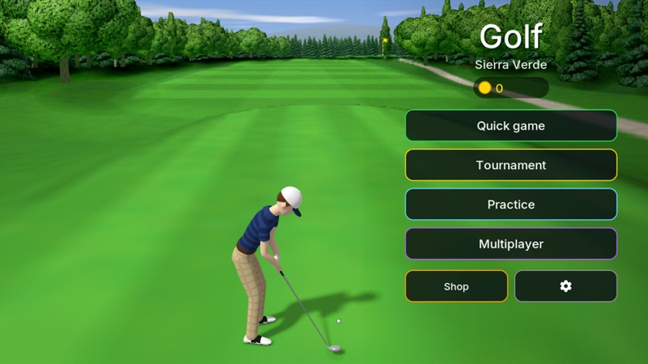 | 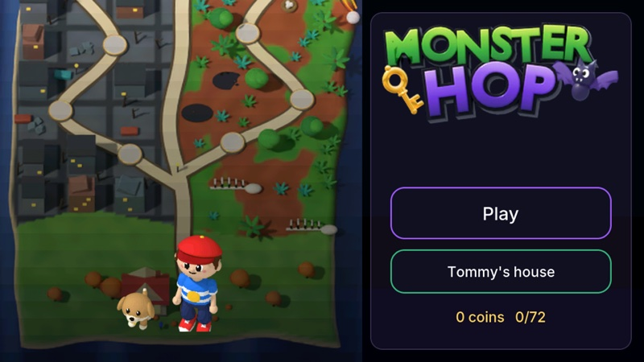 | 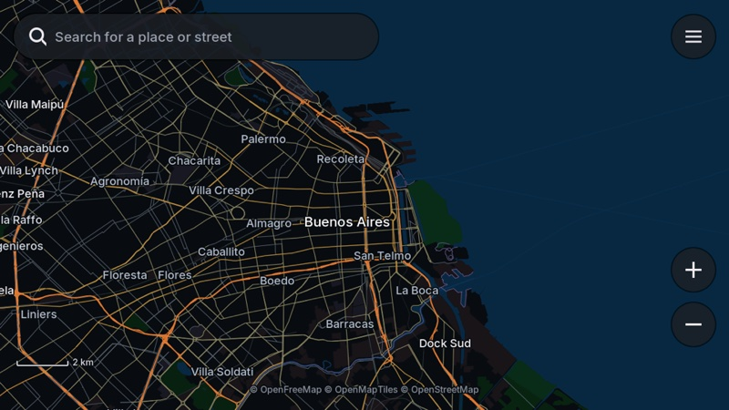 | 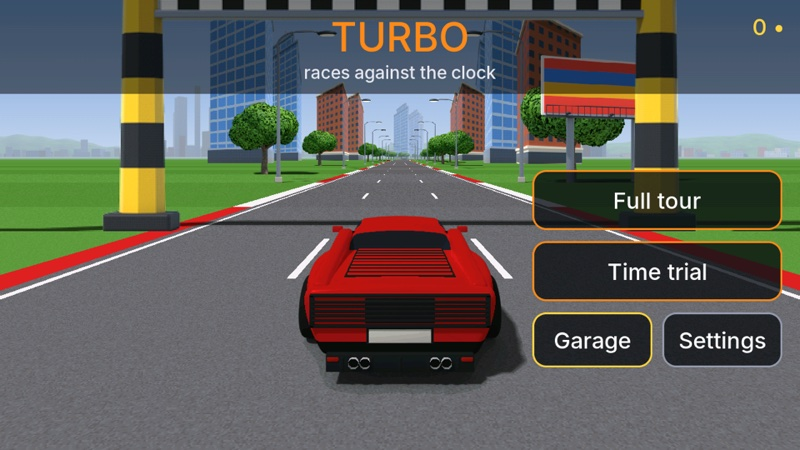 |

Frame rates measured on the board:

| App | Portrait | Landscape |
|---|---|---|
| Doom | – | 35 fps |
| Video | 640×360 at 30 fps; 720×1280 at 24 fps | 1280×720 at 20 fps |
| Visor 3D | ~28 fps with ~16 000 triangles | same |
| Monster Hop | 22 fps | ~20 fps |
| Turbo | 18–19 fps | ~15.7 fps |
| Lua (24 cubes) | 34 fps | |

[docs/APPS-P4.md](docs/APPS-P4.md) has them all, and explains how to write
an app.

### Connected

| | |
|---|---|
| **Web portal** | at `p4os.local`: a file explorer, the firmware (updates, both slots, the last crash dump), the log (including the tail of the previous boot), and the network sweeps (each device with its MAC and maker, what changed since the last one, the Wi-Fi channels). The apps bring their own pages from the card, with no firmware: Notes, Radio, RF, Cameras, Recorder, Weather, Quotes, Maps, Lua, Pixel Art and the 3D viewer have one, and an app can stream live data to its page ([docs/PORTAL-PAGES.md](docs/PORTAL-PAGES.md)) |
| **Updates over the air** | two slots: an update is written into the idle one and boots on trial. If the board restarts in the first 30 s, the bootloader goes back by itself. Settings, Update can go back on purpose |
| **USB** | the OTG port is high speed (480 Mbit/s). **Keyboard and mouse:** keyboard, media keys, mouse, a gamepad, a MIDI keyboard, and a network over the cable (the portal at `192.168.7.1`, 6.7 MB/s). **Disk:** the microSD as a USB drive. The mode is kept across restarts. **Host:** devices on the 40-pin header (5 V from pin 1, data on pins 21/23, 25/27 or both at once, through P4OS's own copy of ESP-IDF's host library): pendrives at `/usb` (7.4 MB/s), keyboards that type into any text field, a mouse pointer, gamepads that play every game ([docs/GAMEPAD.md](docs/GAMEPAD.md)), webcams in Cameras, sound cards for all the board's sound and recording, USB serial ports in the Terminal (CH340, CP210x, FTDI, CDC-ACM), MIDI, and raw devices for apps that bring their own driver (an RTL-SDR in RF); a Raspberry Pi Pico is programmed by copying its `.uf2` ([docs/USB.md](docs/USB.md)) |
| **Its own Wi-Fi** | an access point, `P4OS-XXXX`, next to the home network or alone. Two QR codes: one joins the phone, the other opens the portal at `192.168.4.1`. A phone downloaded from it at ~3 MB/s |
| **Bluetooth** | through the C6. **The phone:** pairs from the iPhone's own Settings, Bluetooth; its notifications, battery and time come to the board, its music shows and is driven from the control centre and the lock screen, and a call can be answered or rejected on the board. **Keyboard mode:** the board is a Mac's or PC's keyboard, mouse and media keys at the same time; the Macro pad's keys and trackpad go over Bluetooth when there is no cable. [docs/BLUETOOTH.md](docs/BLUETOOTH.md) |
| **The C6's firmware** | updated from the P4, with no cable: Settings, Update, or `tools/install_c6.sh`. It runs esp_hosted 3.0.9, the same as the P4, and going back to the factory firmware works the same way. [docs/C6.md](docs/C6.md) |
| **Home** | Home Assistant over WebSocket, MQTT, Wi-Fi at 2.4 GHz through the C6 |

### Settings

The pages are Wi-Fi (with the access point), Bluetooth, USB (each mode
explained), Web portal (trusted networks, the password), Display, Lock screen, Sound, Wallpaper, Expansion, Storage,
Language, Date and time, Update, Diagnostics, About and Developer.

- **Lock screen:** when it locks, the code (none, 4 or 6 digits, changed or
  removed with the current one), and what it shows.
- **Storage:** what fills the card by kind of file, and eject.
- **Update:** both slots, and going back.
- **Diagnostics:** chip temperature, CPU, memory, the reset reason, safe mode,
  the hang watchdog's restarts, the C6's firmware, and the crash dump.
- **About:** the portal's addresses, with a QR code for the phone.
- **Web portal:** which networks are trusted, and a password for the
  others (or for all of them); HTTPS with the board's own certificate; the
  token for scripts ([docs/SECURITY.md](docs/SECURITY.md)).
- **Developer:** touches and frames per second over everything, the log's
  level, the drawing preferences with their factory values, and restarting
  into safe mode without the BOOT button.

| Update | Diagnostics |
|---|---|
| 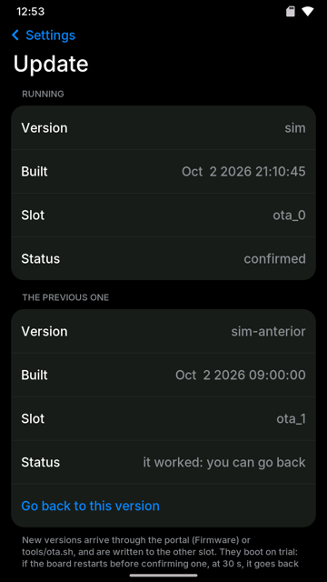 | 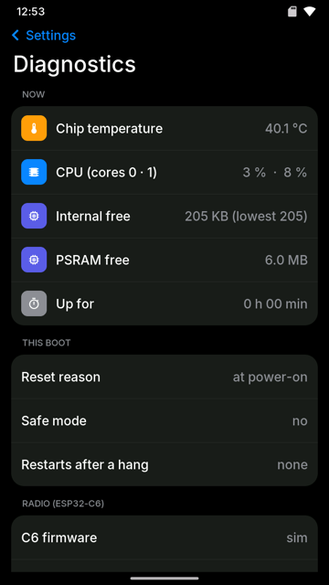 |

| Bluetooth | A notification with emoji |
|---|---|
| 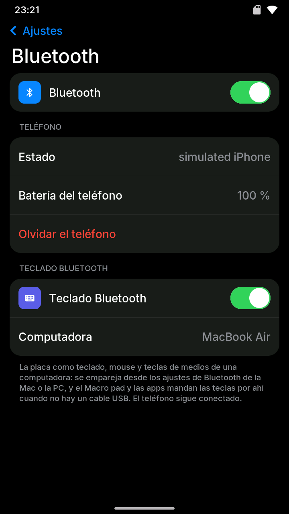 |  |

**Emoji.** Every emoji of Unicode, in colour, in any text the phone sends:
Google's Noto set, 4012 of them with skin tones, flags and ZWJ sequences,
from a pack on the card ([docs/EMOJI.md](docs/EMOJI.md)).

**Languages.** The interface is written in Spanish. English and German are
complete, and travel twice: inside the firmware, so they work with no card,
and as packs on the card. The two are joined string by string with the
card's first, so a fix copied to the card wins, and a card older than the
firmware still gets the new screens translated. A pseudo-locale is used to
test layouts.

## What was tested, and what not yet

**On the board, working:**

- Boot in ~4 s with the card's apps.
- Wi-Fi as a station, and as an access point with a phone on it.
- The portal, and OTA with rollback, tested with an image that panicked on
  purpose.
- The crash dump.
- USB against a Mac: keyboard, mouse, media keys, the gamepad, MIDI, the
  network over the cable, and disk mode. Reads at 8.2 MB/s and writes at
  4.8 MB/s.
- USB host, on both ports at once: a pendrive, a keyboard, a mouse, a
  gamepad, a hub, a webcam (Logitech C270), a sound card (output and
  microphone), CH340, CP2102, FTDI and an Arduino Leonardo and a Pico as
  serial ports.
- A generic USB gamepad in every game: the 22 games and Atrapa (Lua)
  played with it on the board.
- The microSD, music and the speaker.
- The games and most of the tools, in both orientations.
- The BOOT button and safe mode.
- I2C with a real BME280 on the header: found by itself, read once a second
  without errors. SPI with MOSI looped to MISO at 1, 10 and 40 MHz, the port's top speed.
- Settings' Storage page and the QR codes.
- The lock screen with its code, and the languages with no card.
- The C6 updated from the P4 to esp_hosted 3.0.9, and back to its factory
  firmware, with no cable; its flash backed up first through J7.
- Bluetooth with an iPhone 15 Pro Max: listed in its Settings, paired, its
  notifications (with emoji) on the banner and the lock screen, its battery
  and time. At the same time, the keyboard mode with a MacBook Air: text,
  media keys and the Macro pad's trackpad. Its music driven from the
  board, a call answered and one rejected, and a message cleared on the
  phone from the notification centre.
- The network sweep with every host's MAC and maker, saved and compared in
  the portal.
- Settings, Developer: touches and fps over the games, and the safe mode
  asked for from there.
- The Programmer flashing an ESP32 on a CP2102 (6.6 s) and an ESP32-C3 on
  its own USB (1.5 s), plugged into the USB host.
- The workshop on the bench: PWM at three frequencies at once, a servo and
  the analog level; a WS2812B strip; infrared learned and sent; a 24LC256
  read, written and restored; CAN's self test with no transceiver.
- VNC against a MacBook Air with two monitors: the login typed with the
  on-screen keyboard, then the mouse and keyboard.
- RF with an RTL-SDR (R828D tuner) on the USB host: 2.4 Msps with no
  samples lost, unplugged and plugged back while running, and broadcast FM
  heard on the speaker (the stereo pilot 36 to 43 dB over its neighbours).

**Waiting for hardware on the bench:**

- More I2C and SPI chips: the RC522 RFID reader is next (its example is in
  Bus).
- A real DS18B20: it runs in the simulator, and the board comes next.
- CAN on a real bus, with two SN65HVD230 transceivers and an ESP32-C3 as
  the other node.
- A 25xx SPI EEPROM in the EEPROM app.
- The Riden over TTL, the Rigol over the LAN, and the terminal at 460800.
- The IP cameras.
- The microphone's gain, and the speaker's latency and heating.
- The real-time clock with a cell.
- RF with a real 433 MHz remote and sensor (the decoders are tested with
  synthetic signals), and AM and narrow FM with real traffic.

**Not done yet:**

- **RF:** FSK signals, a CC1101 module on the header as a second receiver
  and transmitter, and ADS-B.
- **ESP-NOW:** esp_hosted does not carry it (3.0.9 neither), so the two-device games of
  AmoledOS run alone here.
- **USB host:** MIDI is written but not tried with a device; Xbox pads
  (not HID) are not taken.
- **The network dying during an OTA:** seen twice on 0.6. The link to the
  C6 is now watched and the board restarts by itself in under 30 s, and the
  C6 runs a newer esp_hosted; the cause itself is not found
  ([docs/BUILDING.md](docs/BUILDING.md)).

The board-side checklist is in
[docs/plan/PRUEBAS-PLACA.md](docs/plan/PRUEBAS-PLACA.md) (Spanish).

## The hardware

| | |
|---|---|
| Board | [Waveshare ESP32-P4-WIFI6-Touch-LCD-5](https://www.waveshare.com/esp32-p4-wifi6-touch-lcd-5.htm), the model without a camera ([schematic and docs](https://docs.waveshare.com/ESP32-P4-WIFI6-Touch-LCD-5)) |
| SoC | ESP32-P4, chip rev 1.3 here. Rev 3.x builds as a separate profile, and a binary for one does not boot on the other |
| Display | 720×1280 MIPI-DSI (HX8394) with three frame buffers, and GT911 touch with two fingers |
| Memory | 768 KB internal RAM, 32 MB PSRAM, 32 MB flash |
| Radio | ESP32-C6 over SDIO (esp_hosted 3.0.9): Wi-Fi 6 at 2.4 GHz |
| Audio | ES8311 (speaker) + ES7210 (two microphones), full duplex |
| Other | microSD (4-bit), CH340 serial, RS485, USB 2.0 OTG, the 40-pin header, BOOT, RESET and POWER |

## Building

You need ESP-IDF **v5.5** (the C6 link runs esp_hosted 3.0.9 on it).
[docs/BUILDING.md](docs/BUILDING.md) has the details, and
[docs/C6.md](docs/C6.md) the C6's own firmware.

    tools/build_fw.sh rev1_3                 # the firmware (or rev3_x)
    tools/build_apps.sh                      # every app in apps/, checked against that firmware
    cd sim && cmake -B build && cmake --build build -j8 && ./build/p4os_sim

The first flash goes over the CH340 port:

    tools/build_fw.sh rev1_3 -p /dev/cu.wchusbserial<id> flash

After that, updates go over the air:

    tools/ota.sh p4os.local

The simulator needs SDL2, mbedtls and ffmpeg (`brew install sdl2 mbedtls
ffmpeg`) and LVGL 9.5.0 in `sim/lvgl`. The firmware build has to have
run once first, because it fetches the components whose headers the
simulator shares.

Each push builds both firmware profiles, every app, the C6's firmware and
the emoji and Notes packs on GitHub Actions. The releases carry all of it
with a full-flash bundle, the apps' portal pages and the language packs;
only the games' art packs are attached by hand.

### The card

    /apps/        <app>.so and <app>_p4.pak (the art packs, Notes' fonts)
    /web/         <app>.js — the apps' own pages in the portal
    /lang/        en/, de/ — the language packs
    /fonts/       emoji.pak — the colour emoji
    /firmware/    c6.bin — a firmware for the C6, to install from Settings
    /music/ /photos/ /videos/ /maps/ /notas/
    /redes/       the network sweeps (and oui.txt, the makers' register, if put there)
    menu.txt      the home screen's order and folders
    modules.txt   what is wired to the header

## A note on what is written down

Most comments in this repository explain *why*, not *what*, and many of them
record something that was measured on the board. A few examples:

- **USB descriptors.** The Mac never configured the device until the
  network's notification interval changed from 50 to 9: at high speed that
  field is an exponent, not a count of frames. A MIDI OUT endpoint of 512
  bytes stalled `SET_CONFIGURATION` because esp_tinyusb's receive buffer is a
  fixed 64. And macOS does not list a gamepad that rides inside the keyboard's
  HID interface ([docs/USB.md](docs/USB.md)).
- **Internal RAM.** The free internal RAM went from 112 KB to ~300 KB: code
  out of IRAM, and statics, LVGL's buffers and the USB buffers moved to
  PSRAM. One thing cannot move: a task's control block in PSRAM panics at
  boot ([docs/MEMORY.md](docs/MEMORY.md)).
- **PSRAM bandwidth.** The panel's refresh reads PSRAM at ~100 MB/s, and a
  large `memcpy` there competes with it and flashes the screen. The games'
  bands stay in internal RAM: in PSRAM, Mila's frames took 22–27 ms against
  8–12.
- **Wi-Fi.** Modem sleep put the ping at ~200 ms and TCP at 170 KB/s, so on
  a wall plug the radio stays awake. With the board's own access point up,
  the station stops looking for the home network, because each search scans
  every channel and drops the phone.
- **The C6.** An RPC to the C6 made under LVGL's lock timed out once, froze
  the screen, and panicked inside esp_hosted. Since then the signal strength
  is a cached reading.
- **Listing a folder.** On FAT, a `stat()` per file is O(n²), tens of seconds
  for a few thousand files. Folders are read in one pass of FatFs's own
  records.
- **The build.** A fresh checkout used to build a firmware that had never
  been on the board, because four Wi-Fi settings lived only in the local
  build's `sdkconfig`. They are in `sdkconfig.defaults` now, and a clean build
  matches the board byte for byte in size.

Where something is a guess, it says so.

## Documentation

| | |
|---|---|
| [BUILDING.md](docs/BUILDING.md) | building, flashing, OTA, crash dumps, the watchdogs |
| [MEMORY.md](docs/MEMORY.md) | internal RAM vs PSRAM, the panel's three frame buffers, PSRAM bandwidth, the audit |
| [APPS-P4.md](docs/APPS-P4.md) | writing and installing `.so` apps, drawing a frame, measured fps |
| [USB.md](docs/USB.md) | the OTG port's modes, descriptors and measurements |
| [BLUETOOTH.md](docs/BLUETOOTH.md) | the phone (ANCS), the keyboard mode (HID over GATT), the portal's API |
| [C6.md](docs/C6.md) | the ESP32-C6's firmware: versions, updating it from the P4, throughput, recovery through J7 |
| [EMOJI.md](docs/EMOJI.md) | the colour emoji pack and how a text gets them |
| [MODULES.md](docs/MODULES.md) | the 40-pin header, `modules.txt`, I2C, SPI and GPIO from apps |
| [apps/rf/README.md](apps/rf/README.md) | the software radio: receivers, the signal chain, what was measured, the decoders and their tests |
| [PORTAL-PAGES.md](docs/PORTAL-PAGES.md) | an app's own page in the web portal, from the card, with no firmware |
| [SECURITY.md](docs/SECURITY.md) | who may use the portal: trusted networks, the password, the token, and what is not covered |
| [GAMEPAD.md](docs/GAMEPAD.md) | a USB gamepad in the games: the buttons, game by game, and `aos_pad.h` |
| [MACROPAD.md](docs/MACROPAD.md) | the macro pad: pages, buttons, the gamepad and MIDI faces |
| [CAMERAS.md](docs/CAMERAS.md) | RTSP and MJPEG cameras on this board |
| [HOME-ASSISTANT.md](docs/HOME-ASSISTANT.md), [MQTT.md](docs/MQTT.md), [CLAUDE-APP.md](docs/CLAUDE-APP.md) | the home and service apps |
| [BENCH.md](docs/BENCH.md), [RETRO.md](docs/RETRO.md) | the hardware bench and the retro canvas |
| [docs/plan/](docs/plan) | the plan, the hardware survey, the UI and the expansion header (Spanish) |
| [CHANGELOG.md](CHANGELOG.md) | what each version brought |

## Names and marks

Claude and the Claude Code character belong to Anthropic. The Claude app,
Claudito and Claude Jump are an unofficial homage, made with affection for
the character, and are not affiliated with or endorsed by Anthropic. Doom is
id Software's, and Home Assistant is its owners'. The other products named
in the apps belong to their owners too.

## Licence

MIT, see [LICENSE](LICENSE). Third-party code, fonts, icons and data keep
their own licences; [THIRD-PARTY.md](THIRD-PARTY.md) lists each one and what
it asks for. `apps/doom/` is Chocolate Doom through doomgeneric, under the
GNU GPL v2, and no WAD is included.

## En castellano

P4OS es un sistema tipo iPhone para la
[placa de 5" de Waveshare con ESP32-P4](https://www.waveshare.com/esp32-p4-wifi6-touch-lcd-5.htm).
La interfaz está escrita en castellano y se traduce con los paquetes de
idioma de la tarjeta. Los documentos del plan y de las pruebas en la placa
(`docs/plan/`) están en castellano; el resto, en inglés.

| | |
|---|---|
| Qué hace | inicio con carpetas, pantalla de bloqueo con código, 23 apps propias y 38 de la tarjeta (juegos, notas, mapas, radio, video, Lua, una radio definida por software con RTL-SDR), portal web con las páginas que trae cada app, USB como teclado, mouse, joystick, MIDI, red o disco, red Wi-Fi propia con QR, Bluetooth con el iPhone (notificaciones con emojis en color, su música y atender o rechazar llamadas) y como teclado y mouse inalámbrico de una computadora, el firmware del C6 actualizable desde la placa, y taller con I2C, SPI, 1-Wire, GPIO y tiras LED direccionables |
| Qué se probó | Wi-Fi y red propia, portal, OTA con vuelta atrás, USB contra una Mac, tarjeta, sonido, juegos y casi todas las herramientas, el botón BOOT, un BME280 por I2C, SPI en lazo a 40 MHz, el C6 actualizado a esp_hosted 3.0.9 y vuelta al de fábrica sin cables, Bluetooth con un iPhone y una MacBook a la vez (notificaciones, música y llamadas), los barridos de red con las MAC, y el host USB con pendrive, teclado, mouse, joystick en los juegos, webcam, placa de sonido y adaptadores serie, y RF con una RTL-SDR (2,4 Msps sin pérdidas, FM escuchada en el parlante) |
| Qué falta | probar en la placa el DS18B20 y el RC522, las cámaras, RF con un control de 433 MHz real, y encontrar por qué se cortó la red durante dos OTA |
| Cómo se compila | ESP-IDF 5.5, `tools/build_fw.sh rev1_3`, `tools/build_apps.sh` |
| Cómo se instala | la primera vez por el CH340; después `tools/ota.sh p4os.local` o el portal |
