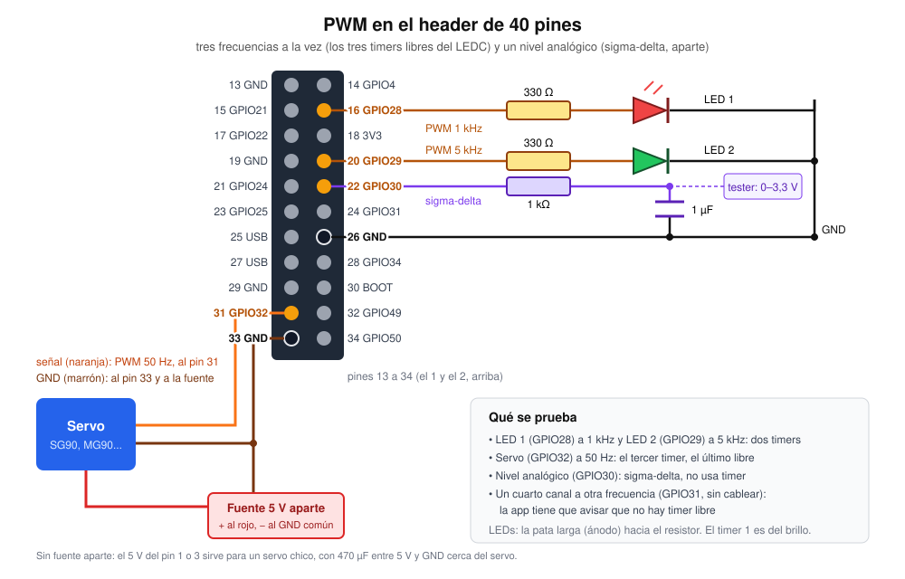
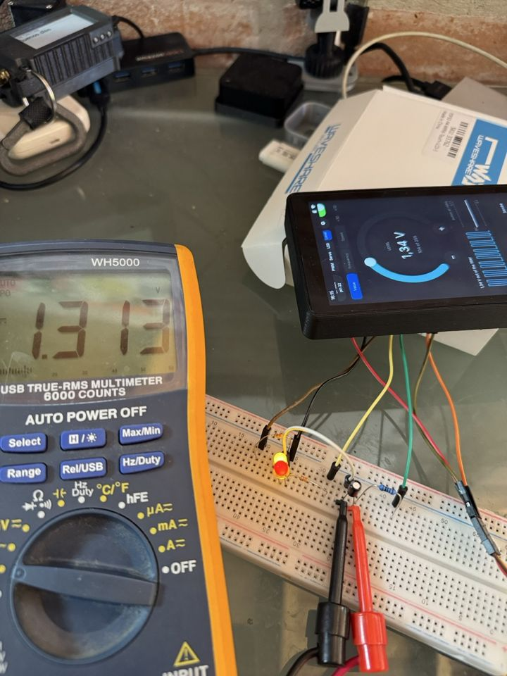
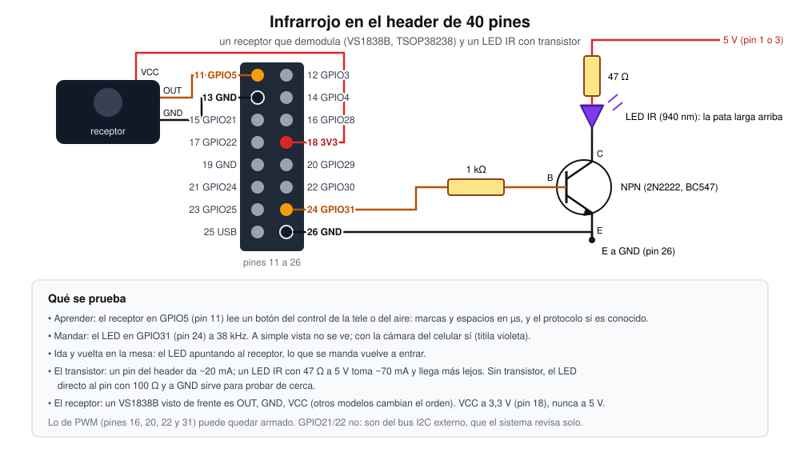

# Modules and sensors on the header

The 40-pin header at the back (J3) is where the bench's extra hardware goes.
This page is about the I2C sensors P4OS reads by itself, how to wire and
declare them, what autodetect does, and how the simulator plays them; and
about the SPI API for the chips an app drives itself ([SPI](#spi)).
The design of the header, its ports and `modules.txt` is in
[plan/EXPANSION.md](plan/EXPANSION.md).

Three places show what is connected:

- **The Módulos app.** It has three tabs:
  - **Header:** the 40 pins drawn as the connector is. Tap a pin to see its
    GPIO, flags, owner and port.
  - **Puertos:** the ports and modules of `modules.txt`, with an editor and
    a form to add a module.
  - **Sensores:** live readings, a chart of the one you pick, and the
    addresses that look like a sensor.
- **The portal's Expansión page** (`http://<name>.local/#expansion`) has
  the same things in a browser. The `modules.txt` editor there checks the
  file as you type.
- **The API:** `aos_sensor_count()`, `aos_sensor_at()`,
  `aos_sensor_value("bme280", "temp", &v)` and `aos_sensor_history()` in
  `components/aos_io/include/aos_sensors.h`. Any app can read the latest
  values without talking to the bus.

The Bus app is still the raw tool: it scans all 112 addresses, shows
registers and drives GPIO levels. Módulos is about what is there.

## Wiring

The default profile gives external sensors their own bus, `i2c.ext`, on
pins that sit together:

| Signal | GPIO | Physical pin |
|---|---|---|
| SDA | 21 | 15 |
| SCL | 22 | 17 |
| 3V3 | - | 18 |
| GND | - | 19 |

- **Pull-ups:** most breakout boards (GY-BME280, GY-302, the INA219 and
  ADS1115 boards) already have 4.7k or 10k pull-ups. The P4 also turns on
  its internal ones, but those are weak (~45k). With a bare chip, or long
  wires, add 4.7k from SDA and SCL to 3V3.
- **Only 3.3 V on the signals.** The header's 5 V pins (1 and 3) are live
  even with the board off. Power 5 V-only modules from there, but never
  pull SDA/SCL up to 5 V.
- **Why not the board's bus (`i2c.board`, GPIO7/8):** it is shared with the
  touch controller (0x14/0x5D), the ES8311 (0x18) and the ES7210 (0x40).
  0x40 is where an INA219 or HTU21 usually sits. A sensor that hangs that
  bus also takes the touch screen with it. You can declare a sensor there
  when you have to. P4OS never autodetects on it, and it refuses the
  board's own addresses.

## Supported sensors

| Chip | What it reads | Addresses | Identified by | Module line |
|---|---|---|---|---|
| BME280 | temperature, pressure, humidity | 0x76, 0x77 | chip id 0x60 at 0xD0 | `module bme280 i2c.ext addr=0x76` |
| BMP280 | temperature, pressure | 0x76, 0x77 | chip id 0x58 (0x56/0x57) | `module bmp280 i2c.ext addr=0x76` |
| SHT3x (SHT30/31/35) | temperature, humidity | 0x44, 0x45 | status read (0xF32D) with a valid CRC | `module sht31 i2c.ext addr=0x44` |
| SHT4x (SHT40/41/45) | temperature, humidity | 0x44, 0x45 | serial number read (0x89) with valid CRCs | `module sht4x i2c.ext addr=0x44` |
| AHT20 (AHT21/25) | temperature, humidity | 0x38 | status byte: calibrated, not busy | `module aht20 i2c.ext` |
| AHT10 | temperature, humidity | 0x38 | as the AHT20 | `module aht10 i2c.ext` (no CRC byte) |
| BH1750 (GY-302) | light, lux | 0x23, 0x5C | cannot be: a candidate | `module bh1750 i2c.ext addr=0x23` |
| INA219 | bus voltage, shunt voltage, current, power | 0x40 to 0x4F | power-on config 0x399F | `module ina219 i2c.ext addr=0x40 shunt=100` |
| INA226 | bus voltage, shunt voltage, current, power | 0x40 to 0x4F | manufacturer id 0x5449 ("TI") at 0xFE | `module ina226 i2c.ext addr=0x40 shunt=100` |
| ADS1115 | four single-ended voltages, A0 to A3 | 0x48 to 0x4B | threshold registers at 0x8000/0x7FFF | `module ads1115 i2c.ext addr=0x48 gain=4096` |

### Units

Each value always has the same unit:

| Quantity | Unit |
|---|---|
| Temperature | °C |
| Humidity | %RH |
| Pressure | hPa |
| Light | lx |
| Voltage | V |
| Current | A |
| Power | W |

The UIs scale them for a bench: mV, mA and mW below 1. The value keys are:

| Chip | Keys |
|---|---|
| Temperature and humidity sensors | `temp`, `hum` |
| BME280/BMP280 pressure | `press` |
| BH1750 | `lux` |
| INA219/226 | `bus`, `current`, `power`, `shunt` |
| ADS1115 | `a0` .. `a3` |

### What each driver does

- **BME280 / BMP280:**
  - At start: a soft reset, then it waits for the NVM copy and reads the
    calibration block (0x88..0xA1, plus 0xE1..0xE7 on the BME280).
  - Then it sets normal mode: temperature ×2, pressure ×16, humidity ×1,
    IIR filter 4, standby 500 ms.
  - The values go through Bosch's integer compensation (datasheet 8.2):
    32-bit for temperature and humidity, 64-bit for pressure.
  - A chip declared as one but answering as the other is read as what it
    says it is.
- **SHT3x:** a single shot at high repeatability without clock stretching
  (0x2400), a 16 ms wait, and 6 bytes whose two CRCs are checked.
- **SHT4x:** the same with 0xFD (high precision) and a 10 ms wait.
- **AHT20:**
  - If the calibration bit is off, it sends the init command (0xBE).
  - Each reading is a trigger (0xAC 0x33 0x00), an 80 ms wait, and 7 bytes
    with the CRC checked.
  - AHT10 has no CRC byte. Declare it as `aht10`.
- **BH1750:** power on, then continuous high-resolution mode (1 lx, 120 ms).
  lux = raw / 1.2.
- **INA219 / INA226:**
  - The current comes from the shunt voltage over `shunt=` (milliohms,
    100 by default: the R100 on the usual boards). The calibration register
    is not used.
  - The INA219 keeps its power-on configuration: ±320 mV and 32 V ranges,
    12 bits. That is also what identifies it.
  - The INA226 gets averaging of 16.
  - Power is bus voltage × current.
  - Only the shunt voltage decides the current. With a 0.1 Ω shunt, the
    INA219's ±320 mV range gives ±3.2 A.
- **ADS1115:**
  - Each round is one single-shot conversion per input (AINx against GND,
    128 SPS, about 9 ms each).
  - `gain=` is the full scale in mV: 6144, 4096 (the default, so 3.3 V
    fits), 2048, 1024, 512 or 256.
  - Never put more than VDD + 0.3 V on an input, whatever the range.

## Declaring a module

A line in `modules.txt` (the card's root) looks like this:

```
module <name> <port> [chip=<chip>] [addr=0x..] [shunt=<mΩ>] [gain=<mV>]
```

- **The name** is the chip (`bme280`, `sht31`, `ina219`...). It can also be
  anything you like, with `chip=` saying what the part is:
  `module banco i2c.ext chip=ina219 addr=0x40 shunt=10`.
- **A name with a suffix**, like `bme280_2` or `ina219-fuente`, also means
  that chip. That is how two of the same kind get different names.
- **`addr=`** is only needed when the address is not the usual one.

A declared sensor is read whatever autodetect thinks. If it does not answer,
it shows the reason:

- no answer at that address;
- a bad CRC;
- another chip at that address (with the id it gave);
- the pins are someone else's;
- the board has one of its own chips there.

The value names come from the module name: `aos_sensor_value("banco",
"current", &a)`.

To edit `modules.txt`:

- **In the app:** Módulos > Puertos. **Editar** opens the file. It is
  checked on every keystroke, and Save stays off until it would load.
  **Agregar** builds a line from chips: chip, port, address, shunt or range.
- **In the portal:** the Expansión page, with the same checks and form.
- **Anything else** that writes the file (Archivos, `PUT /api/fs/put`) is
  also fine. The portal reloads `modules.txt` whenever it is written.

`aos_modules_check()` (`components/aos_io/aos_modules.c`) goes further
than `aos_io_validate()`.

- **Errors:** a duplicate port name is refused. `aos_io_load()` would have
  rejected that file and fallen back to the default profile.
- **Warnings, which still save:**
  - a GPIO in two ports;
  - a module on a port that is not declared;
  - a sensor module on a port that is not I2C.

## Autodetect

The sensor service (`aos_sensors.c`) is a thread that does one round a
second:

1. **It merges** the sensors `modules.txt` declares with the ones
   autodetect found. There is one slot per port and address, twelve at
   most.
2. **For each I2C port with something to do,** it opens the port as
   "Sensores" (claiming SDA and SCL), probes if a probe is due, reads every
   sensor on it, and **closes it again**. The port is held for a few
   milliseconds a second, so the Bus app can scan or dump registers on the
   same port between rounds.
3. **If someone else holds the pins,** for example the Bus app's GPIO tab
   driving GPIO21, the round skips that port quietly. The sensors show "los
   pines los tiene Bus".

### When it probes

- Every 5 s while somebody is looking: the app open, or the portal page.
- Every 60 s otherwise.
- At once after **Buscar de nuevo** or a save of `modules.txt`.
- Never on `i2c.board`.

### How it decides

It probes only the addresses the supported chips use: 0x23, 0x38, 0x40 to
0x4F, 0x5C, 0x76 and 0x77.

- **A chip that proves what it is gets read without being declared.** The
  proof is in the "Identified by" column above: an id register, a
  power-on register value only that chip has, or an answer with a valid
  CRC.
- **Proving never configures anything.** It reads registers and sends only
  the read-only commands a chip answers with its id or a CRC: the SHT
  status and serial number, and the AHT status.
- **A device that answers but proves nothing becomes a candidate.** The UIs
  ask "¿Es un BH1750?" and offer a button that adds the `module` line.
  - The BH1750 is always a candidate: it has no id, and a PCF8574 at 0x23
    looks the same.
  - So is an INA219 whose configuration someone changed, an HTU21 at 0x40,
    or a TMP102 at 0x48.
- **A detected sensor that stops answering at the next probe is dropped.**
  A declared one stays, with its error.
- **After a failed read, a chip is started again on the next round,** in
  case it lost power.

### The service at boot

It starts at boot only if `modules.txt` declares a sensor
(`aos_sensors_autostart()`, from the apps' service tick). Otherwise it
starts the first time something asks: the app, the portal, or an
`aos_sensor_*` call.

## In the simulator

`sim/sensors_sim.c` plays the sensors on every I2C port except
`i2c.board`. Each one speaks its chip's real protocol:

- **Register chips** have a register pointer: BME280, INA and ADS1115.
- **SHT3x and SHT4x** take 16-bit and 8-bit commands with CRC-8 answers.
- **Measurement times are real.** Reading an SHT or AHT too early gets a
  NACK or the busy bit, and an ADS1115 conversion takes 1/SPS.
- **Power-on values are real:** the INA219's 0x399F, the ADS1115's
  thresholds, the BME280's chip id and a calibration block.
- **The readings drift slowly:**
  - the room warms and cools over three minutes;
  - a board on the INA219 draws 120 mA with radio bursts to 300 mA every
    8 s;
  - a pot on ADS1115 A1 sweeps;
  - a hand covers the BH1750 now and then.

The BME280's calibration is Bosch's datasheet example. Its raw ADC values
come from inverting the datasheet's floating-point formulas (8.1) by
bisection. The driver's integer formulas are therefore checked against an
independent implementation: with `P4_SIM_SENSORS_FIXED=1` (no drift, no
noise) the driver reads exactly 25,00 °C, 1006,53 hPa and 50,0 %.

| Variable | Meaning |
|---|---|
| `P4_SIM_SENSORS` unset or `1` | The bench set: `bme280@0x76 sht31@0x44 bh1750@0x23 ina219@0x40 ads1115@0x48`. |
| `P4_SIM_SENSORS=0` | None. `i2c.ext` goes back to the plain register blobs at `P4_SIM_I2C_EXT` (0x76, 0x44). |
| `P4_SIM_SENSORS=bmp280@0x77,sht4x,aht20,ina226@0x41` | Any set. The names are `bme280`, `bmp280`, `sht31`/`sht3x`, `sht4x`, `aht20`, `bh1750`, `ina219`, `ina226` and `ads1115`. The address defaults to the usual one, and there is one device per address. |
| `P4_SIM_SENSORS_FIXED=1` | Constant values, for checking a driver's arithmetic. |

The emulated devices win over the register blobs of `io_sim.c` at their
addresses. The Bus app's register view then shows them too. An SHT31 gives
nothing to a register read, as the real one would.

## SPI

`spi.a` is SCK 52 (pin 38), MOSI 50 (pin 34), MISO 51 (pin 36) and CS 49
(pin 32), with 3V3 on pin 1/17 and GND on pin 40. The port line takes a
`cs=` now, and the default profile has one:

```
port spi.a sck=52 mosi=50 miso=51 cs=49 freq=1000000
module lora spi.a cs=48 rst=46 busy=47      # a second chip on the same wires
```

`miso=` and `cs=` are optional (a display has no MISO; an app can drive its
own CS). `freq=` is the default clock of the port's devices.

### The API (`components/aos_io/include/aos_io.h`)

```c
aos_io_spi_cfg_t c = { .clock_hz = 1000000, .mode = 0 };   /* or NULL: all defaults */
aos_io_spi_t *s = aos_io_spi_open("spi.a", "mi_app", &c);
uint8_t cmd = 0x9F, id[3];
aos_io_spi_write_read(s, &cmd, 1, id, 3);                   /* EF 40 18: a W25Q128 */
aos_io_spi_close(s);
```

| Call | Does |
|---|---|
| `aos_io_spi_open(port, owner, cfg)` | Claims SCK/MOSI/MISO and the CS for `owner`, brings the host up. NULL if the port is not in `modules.txt` or not SPI, a pin is someone else's (the log says whose), the CS is not a usable pin, or no host is left. |
| `aos_io_spi_xfer(s, tx, rx, n, timeout_ms)` | Full duplex, **one CS assertion** however long. `tx` NULL sends 0xFF; `rx` NULL drops what comes in. `timeout_ms` bounds the wait for the wires when another handle on the port is mid-transfer. |
| `aos_io_spi_write_read(s, w, wn, r, rn)` | `wn` bytes out, then `rn` in (sending 0xFF), in one assertion: a register read. |
| `aos_io_spi_set_clock(s, hz)` / `aos_io_spi_clock(s)` | A new clock / what the hardware makes. |
| `aos_io_spi_cs_gpio(s)`, `aos_io_spi_desc(s)` | The CS in use; `"spi.a CS49 1 MHz mode 0"`. |
| `aos_io_spi_close(s)` | Releases the CS, and the wires with the last handle on the port. |
| `aos_io_module_gpio(module, key)` | A GPIO from a module line (`rst`, `busy`, `dio1`...), checked against the header. |

The config: `clock_hz` (0 = the port's `freq=`, else 1 MHz; held between
10 kHz and 40 MHz), `mode` 0-3 (CPOL << 1 | CPHA), `lsb_first`, and `cs`:
`AOS_IO_SPI_CS_PORT` (0, the default: the port's `cs=`, or the `cs=` of
`cfg.module` when that is set), `AOS_IO_SPI_CS_NONE` (-1: no CS, the app
drives one with `aos_io_gpio_*`) or any usable GPIO of the header.

The same owner may open one port several times, one handle per chip; a
different owner is refused while the port is open.

### On the board (`aos_io_p4.c`)

- **Host:** GPSPI2, then GPSPI3 for a second port. Nothing else uses them:
  the panel is MIPI-DSI, the C6 is on SDIO, the PPP link on a UART.
- **Pins:** through the GPIO matrix (the header's GPIOs are not the hosts'
  IO_MUX pins). The clock is held to 40 MHz; the driver rounds to what its
  divider makes, and `aos_io_spi_desc()` shows that. MISO gets the internal
  pull-up, so nothing connected reads 0xFF.
- **DMA:** `SPI_DMA_CH_AUTO`, through two bounce buffers of 2 KB each in
  internal DMA RAM, cache-line aligned, made when the port's bus comes up
  and freed with it. That is 4 KB of internal RAM while a port is open.
  It is not PSRAM because GPSPI DMA from PSRAM shares bandwidth with the
  panel's framebuffers, and the IDF says it then drops bytes silently.
  Longer transfers go in 2 KB pieces with CS held low between them
  (`SPI_TRANS_CS_KEEP_ACTIVE`). The driver still copies an RX buffer
  whose length is not a whole number of cache lines. The pieces are cut so
  only the last bytes (under 64) take that path.
- **Polling:** a piece that keeps the bus busy for under 100 µs is polled.
  Longer ones go through the interrupt and the task sleeps.

### In the simulator (`sim/io_sim.c`)

`P4_SIM_SPI_A` (`P4_SIM_<PORT>`, as the UARTs) says what is on the wires:

| Value | What answers |
|---|---|
| unset | `49=w25q128,48=max31855,47=mcp3008`: a chip per CS GPIO |
| `49=max31855,48=w25q128` | your own map |
| `mcp3008` | that chip on any CS, and with none |
| `loop` | MOSI wired to MISO: the jumper from pin 34 to pin 36 |
| `none` | nothing: 0xFF |

- **`w25q128`**
  - IDs: `9F` → `EF 40 18`, `90` → `EF 17`, `AB` → `17`, `4B` → a
    unique id.
  - Commands: `05`/`35` status, `03`/`0B` read, `06`/`04` write enable,
    `02` page program, `20`/`D8`/`C7` erase.
  - Only the first 64 KB are kept. They start with a line of text.
- **`max31855`:** a K junction near 24 °C that drifts, and the chip near
  26 °C. Use `max31855:open` for an open probe.
- **`mcp3008`:** emulated bit by bit after the start bit, with VREF at
  3.3 V. The channels:
  - ch0: a slow sine
  - ch1: mid-scale
  - ch2: a 30 s ramp
  - ch3: ground
  - ch4: 3V3
  - ch5: a light sensor
  - ch6 and ch7: floating

With no CS, the chip is the one whose CS GPIO the app holds low. The chips
also act like real ones:

- A mode they do not speak shifts the reply by one bit.
- A clock above their maximum flips the odd bit.
- LSB-first reverses each byte on the wire.

### The Bus app's SPI tab

You pick the port, clock, mode, CS and bit order. The CS list is the
port's, those of its modules, or none. Then:

- **Bytes:** type them on a hex keypad. **Enviar** shows TX, RX and the
  ASCII of RX.
- **Examples:** these fill the bytes, set mode 0 at 1 MHz and send:
  - "Memoria flash: leer ID (9F)": the maker and size.
  - "MAX31855: temperatura": both temperatures, or the fault.
  - "MCP3008: canal N": the count and the volts. The CH chip changes N.
  - "Lazo": 16 bytes that must come back. **Try this first on the board:**
    a jumper from pin 34 to pin 36.
- **Errors:**
  - All 0xFF or all 0x00 is read as nobody there.
  - When the port cannot open, it says why: the port is not in
    `modules.txt`, or "GPIO50 lo tiene Bus".

The tab claims pins as `Bus SPI`, not `Bus`. A pin the GPIO tab holds is
then refused, not taken over.

## 1-Wire

`aos_io_ow_*` opens a 1-Wire bus on any usable GPIO of the header, with an
owner like every other port. On the board it is Espressif's `onewire_bus`
over the RMT, one TX and one RX channel a bus: the slots are timed by the
peripheral, not by a loop with interrupts off.

- **The bus:** `aos_io_ow_reset()` (a presence pulse), `aos_io_ow_search()`
  (the 64-bit ROM ids, family code in the low byte), and raw writes and
  reads. `aos_io_ow_family()` names the codes (0x28 DS18B20, 0x10 DS18S20,
  0x22 DS1822, 0x3B MAX31850, ...).
- **The DS18B20 family:** `aos_io_ds18b20_convert_all()` starts every sensor
  at once (skip ROM) and says how long to wait (750 ms at 12 bits).
  `aos_io_ds18b20_read()` reads one, checks the scratchpad's CRC and gives
  degrees and the resolution. `aos_io_ds18b20_set_bits()` changes the
  resolution and keeps it in the sensor's EEPROM. 85.0 straight after power
  up is the part's reset value, not a reading.
- **Wiring:** GND, data to the pin, VDD to 3V3 (pin 18), and 4.7 kΩ between
  data and 3V3. The internal pull-up is enough for one sensor on a short
  cable.
- **Bus, 1-Wire tab:** pick the pin, search, and every sensor is read once a
  second in a thread of its own, with its resolution.
- **The simulator:** `P4_SIM_ONEWIRE` says what hangs off any pin opened as
  a bus. Unset, two DS18B20s: one near 23 °C, one that warms and cools over
  a minute. `none` for nothing, or a number for that many.

## LED strips

`aos_io_strip_*` sends an addressable strip on any usable GPIO: the
single-wire kind (WS2812B and the WS2813/WS2815/WS2811 at 800 kHz, the
WS2811 at 400 kHz, SK6812, SK6812 RGBW), with the colour order. The RMT
sends it from a frame in PSRAM, refilled by its ISR; there is no DMA,
because its buffer would be internal RAM.

The **LED Strips** app does not drive the strip itself. A service,
`aos_leds.c`, does, and keeps going with any app in front:

- **The effects:** 13 of them, at up to 50 fps.
- **The limiter:** the current estimate is WLED's (a LED draws its mA at
  full white, shared by its channels, linearly with each one), and the
  frame is dimmed to stay within the supply's budget.
- **Kept across restarts:** the configuration lives in the preferences, and
  a strip left on comes back at boot.

Fire is Mark Kriegsman's Fire2012 algorithm, as FastLED and WLED have it,
written again here.

## PWM, an analog level, infrared and CAN

Since 0.9.2, for the workshop apps (0.10). The API is in `aos_io.h`, the shared
part in `components/aos_io/aos_io_signal.c`, the board's in
`aos_io_signal_p4.c` and the simulator's in `sim/io_signal_sim.c`. Each
one takes any usable GPIO of the header and claims it, like the rest.

| What | Hardware | Limits |
|---|---|---|
| `aos_io_pwm_*` | the LEDC, from the 40 MHz crystal | seven channels (the eighth is the backlight), three frequencies at once; 1 Hz to 20 MHz, 20 bits of duty up to 38 Hz, 15 at 1 kHz, 1 at 20 MHz; servo pulse in microseconds; hardware fades |
| `aos_io_dac_*` | the sigma-delta modulator, 1 MHz | the P4 has no DAC: 1 kOhm and 1 uF to ground give 0-3.3 V with a few mV of ripple, 256 steps, eight channels; not for audio |
| `aos_io_ir_*` | the RMT, 1 us a tick | in: a demodulating receiver (TSOP38238, VS1838B), up to 1024 marks and spaces a frame, two buffers so the next frame lands while one is read; out: an IR LED through a transistor, the carrier settable (38 kHz, 33 % by default, or none) |
| `aos_io_can_*` | the TWAI controllers, classic CAN 2.0 | 25 kbit/s to 1 Mbit/s; normal, listen only, and a self test that needs no transceiver (one pin for TX and RX); a queue of 64 received frames with time stamps |

**Wiring for a bench test of PWM** (what was tried on the board): two
LEDs at two frequencies, a servo at 50 Hz on its own 5 V, and the analog
level through its RC filter, with a meter on it.



Tried on the board on 2026-10-05, wired as drawn on a breadboard, all
four channels at once from the PWM app:

| Channel | Asked | What the hardware gives |
|---|---|---|
| LED 1, GPIO28 | 1 kHz, a sine pattern | 998 Hz, 15 bits |
| LED 2, GPIO29 | 5 kHz, breathing | 5000 Hz, 12 bits |
| Servo, GPIO32 | 50 Hz, 500-2500 us | 50 Hz, 19 bits; both ends and the sweep |
| Analog, GPIO30 | 104/255 = 1.34 V | 1.313 V on a meter (-27 mV, 2 %), steady but for a few mV of breadboard noise |



**Wiring for a bench test of infrared:** a demodulating receiver on
GPIO5 (not GPIO21/22, which the I2C service scans by itself) and an IR LED
driven through an NPN transistor from 5 V.



**A pin let go** (an output closed) rests at its off level through the
weak pull: down, or up for an inverted PWM output. `gpio_reset_pin()`
alone leaves the pull-up on, and a servo whose channel was switched off
moved by itself on a line held weakly high.

**On a real CAN bus** a 3.3 V transceiver goes between the pins and
CANH/CANL (SN65HVD230 and kin): the header's pins are not 5 V tolerant.

**The clock of the LEDC.** All its timers share one clock, and the
backlight's (set up by the BSP) is the crystal. Asking for the 80 MHz PLL
failed on the board with "timer clock conflict", so PWM runs from 40 MHz.

**Trying them without an app:** `POST /api/expansion/selftest?gpio=28`
opens each on a free pin with nothing wired and says what happened: PWM
(frequency and bits at 1 kHz and 50 Hz, a fade, a servo pulse), the
analog level, an IR frame out (NEC, 68 ms), and CAN in its self test
(frames sent and heard back). With `&gpio2=` and a jumper between the two
pins, the IR frame also comes back in. On the board, on 2026-10-05: all
of it worked on GPIO28 and GPIO32.

**In the simulator** PWM and the analog level keep the board's limits and
numbers. What an IR output sends reaches every IR input, and a NEC remote
in the room presses a key every 6 s (`P4_SIM_IR_REMOTE=0` stops it). All
the CAN nodes share a bus with a car on it (engine speed 0x0C0, vehicle
speed 0x1A0, temperatures 0x3E8, a J1939-style 0x18FEF100;
`P4_SIM_CAN_TRAFFIC=0` takes it off), and a node in the self test hears
only itself.

**EEPROMs** have no API of their own: they are I2C, SPI or GPIO. The
simulator emulates the three families (`sim/eeprom_sim.c`): 24xx on I2C
(`P4_SIM_EEPROM`, a 24LC256 at 0x50 by default), 25xx on SPI (a 25LC640 on
CS GPIO46) and a 93xx clocked on GPIOs (`P4_SIM_93C`).

## Not done yet

- **Relays** (a Phase 6 extra): not in this round.
## What only the board can confirm

Everything above has run against the emulation only. When the board comes,
check these:

- **Opening the port every round.** `i2c_new_master_bus()` and
  `i2c_del_master_bus()` run once a second on `i2c.ext`. Watch for heap
  churn and GPIO glitches when the bus is torn down, and check that a
  claim released between rounds lets the Bus app in.
- **Eight devices per port.** `aos_io_p4.c` keeps at most 8 devices per
  open port (`DEVS`). Autodetect adds one for every address that answers
  an identify read, plus one per sensor read. More than 8 answering
  devices on one port would make the last ones fail.
- **Pull-ups only.** A bus with nothing on it and only the internal
  pull-ups: probes should NACK fast, not wait for the 30 ms timeout on
  every address.
- **Real chips.** Check each one against the "Identified by" column: that
  a real SHT4x NACKs the SHT3x status command, that a real INA219 reads
  0x399F after power-on, and that an AHT20 fresh from power-up reports
  itself calibrated.
- **Accuracy.** Compare the BME280 compensation with a reference
  thermometer or barometer, and the INA219/226 current with a meter
  (shunt tolerance).
- **SPI, none of it run yet.**
  - The loopback first (jumper 34 to 36) at 1, 10 and 40 MHz.
  - A transfer over 2 KB: check that CS stays low between the pieces.
  - `spi_device_get_actual_freq()` against a scope.
  - That MISO's pull-up gives 0xFF with nothing connected.
  - The internal heap before, during and after a port is open: 4 KB of
    bounce buffers plus the driver's own.
