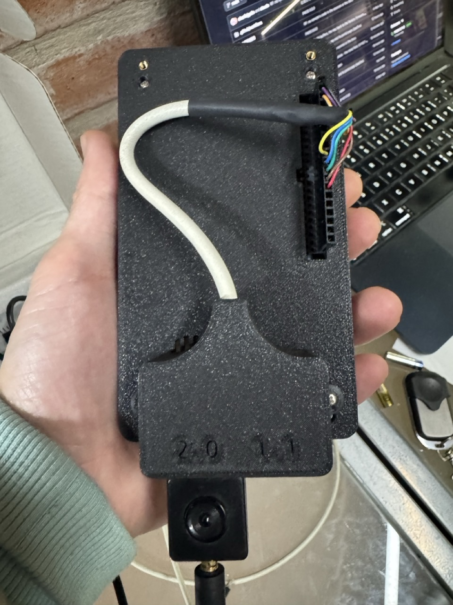

# USB on the P4

The board's "OTG" connector is the P4's own USB 2.0 High-Speed port
(480 Mbit/s). The console lives on the other connector (the CH343 UART), so
the OTG port is free for whatever it is asked to be. It is chosen in
**Settings → USB**, which says what each mode does (the USB host, for
devices plugged into the board, is a switch of its own, at the end):

| Mode | What the computer sees | The card |
|---|---|---|
| Off | nothing | on the board |
| Keyboard and mouse | a HID keyboard, mouse and media keys, a gamepad, a MIDI keyboard and a network (the Macro pad, `docs/MACROPAD.md`) | on the board |
| Disk | the microSD as a USB drive | the computer's, until it ejects it |

The mode is remembered across restarts (pref `usb_mode`,
`aos_hal_usb_restore()` once the boot has read the card): after an OTA the
port is back as a keyboard 4 s after boot. Disk mode is not remembered: the
boot reads the card, so a restart in disk mode comes back in the mode it had
before.

Opening the Macro pad switches an idle port to keyboard and mouse. It does
not take the port away from disk mode: the computer has the card then, and
taking it back is for Settings to do.

The code is `components/aos_hal/aos_usb_p4.c`. Every step goes to the log,
which the portal shows (**Registro**, filter `usb`).

## Keyboard mode

One composite device (VID 0x303A, PID 0x402C, class MISC/IAD), six
interfaces, all at High Speed:

| Interface | What | Notes |
|---|---|---|
| HID | keyboard, media keys, mouse | report ids 1-3 |
| HID | gamepad: one stick, hat, 32 buttons | an interface of its own, see below |
| CDC-NCM (two) | a network over the cable | the board is 192.168.7.1 |
| MIDI (two) | board → computer only | one IN endpoint, see below |

The Macro pad drives all of it: its pages, the trackpad, and two faces for
the gamepad (**Mando**) and the piano (**MIDI**).

Measured on a Mac on 2026-09-30:

| | |
|---|---|
| Network | the Mac gets 192.168.7.2 by DHCP (`en9`), ping 0.5 ms; the portal downloads at **6.75 MB/s** (1.7 over Wi-Fi; 7.4 while TinyUSB's buffers were internal) |
| Internet | stays on the Mac's Wi-Fi: the DHCP offer has no router and no DNS |
| mDNS | `p4os.local` resolves to 192.168.7.1 first. `curl` without `-4` waits 5 s for an IPv6 address the board does not have; browsers do not |
| MIDI | 14 notes, a two-finger chord, 48 bends and 43 mod wheel (CC 1) messages, all received in order, none stuck; CC 123 on leaving the face |
| Gamepad | seen by the browser's Gamepad API as a gamepad |

Three things the first plug-in taught:

- **The notification interval at High Speed.** TinyUSB's NCM template sets
  the notification endpoint's interval to 50, which is frames at Full Speed
  but an exponent (1..16) at High Speed. The Mac never configured the
  device. It is 9 now (32 ms).
- **MIDI in one direction.** A High Speed bulk endpoint is 512 bytes, and
  esp_tinyusb fixes the MIDI receive buffer at 64 (`CFG_TUD_MIDI_RX_BUFSIZE`,
  not a Kconfig option): opening the OUT endpoint failed, and the Mac's
  SET_CONFIGURATION got a stall. The pad only sends, so the port has one
  IN endpoint (`MIDI_OUT_DESCRIPTOR`). `tud_midi_mounted()` wants both
  directions, so readiness is the keyboard's.
- **The gamepad on its own interface.** As a fourth report of the keyboard,
  macOS saw a keyboard with a gamepad inside: nothing listed it, and opening
  a keyboard needs the Input Monitoring permission. Alone it is a plain
  gamepad (`CONFIG_TINYUSB_HID_COUNT=2`).

The NCM buffers are TinyUSB's, four each way, in PSRAM.

## Disk mode

Choosing it:

1. closes every other app, so nothing has a file open on the card;
2. leaves two files on the card for macOS (below);
3. lets go of the card: the player stops, FAT is unmounted, the SDMMC host
   shut (`aos_hal_sd_release`);
4. initialises the card again with no filesystem (`aos_p4_sd_card_open`) and
   hands its sectors to esp_tinyusb's MSC storage.

While the computer has it, the card's apps do not open (a toast says why)
and `aos_hal_sd_present()` is false.

**Ejecting it on the computer is the way back.** esp_tinyusb mounts the card
back for the board when the computer ejects it (or goes away), and that ends
disk mode: the port goes back by itself to the mode it had before, and the
card is mounted the usual way. The card is never on both sides at once.
Choosing another mode in Settings also ends it, but without the eject the
computer loses the disk under its feet (it warns so).

Measured on a Mac on 2026-09-30, 16 GB card:

| | |
|---|---|
| Enumeration | High Speed, "SDCARD" 15.9 GB; macOS asks to allow the accessory once (another product id than the keyboard: 0x4002) |
| Read | 8.2 MB/s (a 37 MB pack in 4.5 s) |
| Write | 4.8 MB/s (64 MB) with the 32 KB buffer in PSRAM; 3.3 with 8 KB internal |
| Integrity | 64 MB written by the Mac, read back by the board through the portal: same SHA-256 |
| Eject → card back on the board | at once; the board mounts it again in ~60 ms |

The transfer buffer is TinyUSB's, 32 KB in PSRAM
(`CONFIG_TINYUSB_MSC_BUFSIZE`; TinyUSB's buffers live in PSRAM since the
internal RAM audit, `docs/MEMORY.md`).

### macOS and the card

- **Spotlight.** A Mac indexes every volume it is given. The first time,
  the eject was refused for minutes ("dissented by mds"). Entering disk mode
  now leaves `.metadata_never_index` and `.fseventsd/no_log` at the card's
  root, and the eject went through at once.
- **AppleDouble files.** Copying from a Mac leaves `._name` next to each
  file. Everything on the board that lists the card skips names starting
  with a dot (apps, icons, music, photos, maps, videos, Lua); the portal's
  file browser shows them, so they can be deleted.
- **VBUS is not monitored,** so pulling the cable without ejecting looks to
  the board like a suspended bus, not an unplug: the card stays on the USB
  side until a mode is chosen in Settings.

## The USB host

The board is also a USB host, with a switch of its own in Settings, USB,
"USB host" (`POST /api/usb {"host": true}`), remembered across restarts
(pref `usb_host`), beside the OTG connector's mode. It takes pendrives,
keyboards, mice, gamepads, media keys, MIDI devices, USB serial ports and
webcams, on one port or two at once, and behind hubs.

### The ports

The OTG connector gives no 5 V, so a device plugged into it gets no power:
devices go on the 40-pin header instead, next to 5 V (a USB-A socket on
wires, or a cut USB cable). There are two ports, chosen in Settings, USB,
"Data pins" (`POST /api/usb {"pins": "21/23" | "25/27" | "both"}`, pref
`usb_hport`):

| Device | Pins 21/23 (default) | Pins 25/27 |
|---|---|---|
| VBUS (red) | pin 1 or 3, 5 V | the same |
| D- (white) | pin 21, GPIO24 | pin 25, USBD_N |
| D+ (green) | pin 23, GPIO25 | pin 27, USBD_P |
| GND (black) | pin 5 | the same |
| Controller | the P4's second one, Full Speed (USB 1.1, 12 Mbit/s) | the High-Speed one (480 Mbit/s), the OTG connector's |
| The OTG connector meanwhile | keeps its mode (off, keyboard and mouse, disk) | unplugged: its lines are the same wires; its mode is off while the host is on |

The prototype on the user's board: both sockets in a 3D-printed back
cover, wired to the header, "2.0" on pins 25/27 (High Speed) and "1.1" on
21/23 (Full Speed); an RTL-SDR in the High-Speed one.

"Both" is the two at once, as two root ports of one host library: a
keyboard on 21/23 and a pendrive on 25/27, say. ESP-IDF's library drives
one root port; `components/usb` is P4OS's copy of it, changed to drive one
per controller (`components/usb/P4OS.md` says what changed and how to
update it).

**The wires decide** (2026-10-04, a Kingston DataTraveler 2.0 of 8 GB,
FAT32). With wires of about 70 cm, the High-Speed controller on 25/27 saw
the pendrive connect and every port reset failed ("HUB: Root port reset
failed"), at High Speed and forced to Full Speed (`FSLSSupp`) alike, while
21/23, at Full Speed, mounted it at once. With the same wires cut under
15 cm, 25/27 mounted it at High Speed: **7.4 MB/s** reading a 1.5 MB photo
on the board (`/api/fs/bench`), the same with a keyboard on 21/23 at the
same time. Through the portal over Wi-Fi it is about 450 KB/s down and
250 KB/s up (a 4 MB file written, read back identical and deleted): there
the Wi-Fi is the limit. Full Speed tops at about 1 MB/s.

**Pins 21/23 and the backlight.** The P4 has two FSLS PHYs: PHY 0 on
GPIO24/25, PHY 1 on GPIO26/27. At power-on the USB-Serial-JTAG is on PHY 0
and the Full-Speed controller on PHY 1, and ESP-IDF leaves it there - but
**GPIO26 is this board's backlight PWM**. So the host, on this port,
switches the USB-Serial-JTAG's pads off and swaps the two
(`usb_wrap_ll_phy_select(&USB_WRAP, 0)`, in `LP_SYS`, before the PHY is
set up, whose reset of the wrap does not touch it), and puts back the
40 mA drive the PHY driver gave GPIO26/27 thinking the pads were there.
Stopping turns the controller's pads off and swaps back; as `LP_SYS`
survives a software restart, every boot swaps back too (a constructor in
`aos_usb_p4.c`). The USB-Serial-JTAG is not used on this board (the console
is the CH343 UART) and reaches no connector.

The pads go off only after the host library is down. Cut first, with a
pendrive on the port, the port saw a sudden disconnection and the
library's port power-off failed its assert (`hub_root_stop`, hub.c), which
restarted the board (seen on 2026-10-04 moving the host from 21/23 to
25/27 with a pendrive mounted).

On 25/27 the controller also gets VBUS and the A-session valid by
override: this board's VBUS (the OTG connector's and the header's 5 V)
reaches no pin of the P4. (On 21/23 ESP-IDF gives them through the GPIO
matrix.) The PHYs are set up by `aos_usb_p4.c` itself (`skip_phy_setup`):
the library's own setup does only one.

Only one device can sit at address 0, where a device is enumerated: when
both ports connect at once (both plugged in at boot) the second waits for
the first's enumeration (`hub_root_enum_done`). The log says each root
port's state when it changes (`host port 25/27: connected, enabled,
speed...`), and every device as it comes (`device 2: 04f2:0402 "Chicony
USB Keyboard", class 03, low speed, on 21/23`). A couple of failed
enumerations (`ENUM: CHECK_SHORT_DEV_DESC FAILED`) while a plug goes in
are normal: the contacts bounce, and the next try works.

**Hubs** are on (`CONFIG_USB_HOST_HUBS_SUPPORTED`), and they work, but
**wiring the devices to the two ports directly is the recommended way**.
Tried on 2026-10-04 with a 7-port hub without its own supply (two 4-port
chips in a chain) on 21/23 and a pad plugged into each of its ports: the
pad came up and read on every port, but 2 times in 4 the whole hub fell
off the root port as the pad's port was reset, and came back by itself
half a second later (most likely the 5 V dipping, through the wires from
pin 1, at the moment of plugging in); and once the hub refused a port
status request right after powering its ports and stayed out until it was
unplugged. A hub with its own supply also gives the devices their 5 V. The
hubs themselves do not show in the devices list (the library does not
announce them to its clients); what hangs from them does, with the hub's
port. On 25/27 a High-Speed hub
runs at High Speed; a Full- or Low-Speed device behind a High-Speed hub
needs split transactions, which ESP-IDF does not do (a keyboard behind a
High-Speed hub on 25/27 does not work; on 21/23 it does).

### The devices

Each kind of device is a client of the host library, in its own file of
`components/aos_hal`; a device can have several (a keyboard with media
keys is two HID interfaces):

| File | What | Comes out as |
|---|---|---|
| `aos_usb_devs_p4.c` | every device, known or not: IDs, names, class, speed, port, hub port | Settings, USB (a line each, with what it is used for or "not used yet") and `/api/usb` `devices` |
| `aos_usb_p4.c` + `usb_host_msc` | pendrives, card readers, disks (FAT32) | `/usb`, `/usb2`, `/usb3` (FATFS has four volumes: the card and these); Files and the portal |
| `aos_usb_hid_p4.c` | keyboards, mice, gamepads and joysticks, media keys | keys in the open text field, a pointer, `aos_hal_hid_gamepad_get`, volume and play/pause |
| `aos_usb_midi_p4.c` | MIDI keyboards, pads, controllers | `aos_hal_midi_read` / `_send`; MIDI thru to the computer |
| `aos_usb_serial_p4.c` + `usb_host_cdc_acm` (+ CH34x, CP210x, FTDI) | Arduinos, boards with native USB, USB-serial adapters | ports `usb0`, `usb1` of aos_io: the Terminal opens them like its UARTs, and the Programmer flashes an ESP32 through them |
| `aos_usb_uvc_p4.c` + `usb_host_uvc` | webcams (MJPEG) | a camera of the Cameras app while plugged in (`usb://0`) |
| `aos_usb_uac_p4.c` + `usb_host_uac` | USB sound cards and headsets | the board's sound, instead of its speaker |
| `aos_usb_raw_p4.c` | anything an app brings its own driver for (vendor class: a software radio) | `aos_hal_usb_raw_*`, see "Raw devices" below |

**HID** reads each interface's report descriptor: which usage is where in
each report, signed or not, relative or absolute, under which application
collection (keyboard, mouse, joystick or gamepad, consumer control), also
several on one interface told apart by report ID (a wireless receiver).
The boot protocol is only the fallback for a keyboard or mouse whose
descriptor cannot be read. Then:

- **Keyboards** (also NKRO ones) type where the on-screen keyboard would
  while one is open (`components/aos_ui/aos_hwkbd.c`): into the text area
  of the open LVGL keyboard, with Enter as its OK and Esc as its close;
  with none open, Esc is "back". An app with a keyboard of its own takes
  the keys with `aos_ui_hwkbd_handler()` while it is up (Notas does, so
  it takes physical keys only while its own keyboard is showing). The
  layout is Latin American (ñ, ¿¡, AltGr for @, the acute and the
  diaeresis as dead keys) or US, in Settings, USB, "USB keyboard"; a key
  held repeats; Caps Lock lights the keyboard's LED.
- **Media keys** (volume, mute, play/pause, next, previous) act on what
  the control centre would control, the board's player or the iPhone's.
- **Mice** move an arrow (`components/aos_ui/aos_hwmouse.c`, a second
  LVGL pointer beside the touch screen): the left button is a finger, the
  wheel scrolls what is under the arrow, right is "back", middle "home";
  the arrow hides after 4 s still. An absolute pointer (a USB touch screen,
  a tablet) maps its surface onto the screen.
- **Gamepads and joysticks** are a state a game reads each frame
  (`aos_hal_hid_gamepad_get`): buttons as the pad numbers them, eight axes
  scaled to +-32767, the hat, and `aos_hal_hid_gamepad_dpad()` from the hat
  or the left stick. HID has no standard button layout, so a game offers
  to map them. Xbox pads are not HID (XInput): not taken yet.
  `/api/usb` `gamepads` shows them live, to see what each button is.

**MIDI**: messages in a queue (system exclusive left out), the last eight
in `/api/usb` `midi_last`. With the host on 21/23 and the OTG connector in
keyboard mode with the computer, a MIDI keyboard on the board also plays
on the computer (MIDI thru).

**Serial**: tried with a CH340 converter (loopback at 9600, 115200 and
921600 baud), an Arduino Leonardo (CDC-ACM, with a keyboard on the same
device: `tools/usb_test/`), an ESP32 board's CP2102 (its boot log), an
FTDI FT232R (loopback at 9600, 115200 and 921600, reopened between each)
and a Raspberry Pi Pico with MicroPython (its REPL: commands typed from
the board, answers back).

Once a serial device is opened, its USB side stays open until it is
unplugged: closing the port puts it at rest (what comes in is dropped) and
opening it again takes it back at the new speed. Closing and reopening it
for real lost the first packet after every reopen with the FTDI: the
CDC-ACM driver resets its side of the endpoints on close but not the
device's, and their data toggles part ways.

**A Pico (RP2040) is programmed from the board.** In BOOTSEL mode it is a
mass storage device ("RP2 Boot", `INFO_UF2.TXT`), mounted at `/usb` like
a pendrive: copying a `.uf2` there (`PUT /api/fs/put?path=/usb/x.uf2`, or
Files in the portal) writes it, and the Pico restarts into it as the last
block arrives. The copy then answers an error (the drive went away before
the file was closed): that is the sign it took. Tried on 2026-10-04 with
MicroPython v1.29.0 (680 KB, about 4 s); it came back as a CDC-ACM port. Listed while plugged in, opened when the Terminal (or anyone
through aos_io) opens `usb0`; DTR and RTS go up on open, as a computer's
terminal does (an Arduino resets, a CDC device that waits for a terminal
starts sending). Received bytes wait in 16 KB of PSRAM.

**The Programmer flashes an ESP32 through them** (since 0.9.2): the USB
ports come after the header's UARTs in its list, in the app and in the
portal. EN and BOOT go through RTS and DTR (`aos_hal_usb_serial_lines`),
as esptool drives them: on a dev board with the usual two transistors, RTS
asserted pulls EN low and DTR asserted pulls GPIO0 low, so the board goes
into its bootloader with no button. Tried on 2026-10-05 with an ESP32
(v3.1, 4 MB) on a CP2102: detected in 0.8 s, and a test firmware
(`tools/usb_test/hola_esp32`, 200 KB) written at 460800 baud, MD5-checked
and restarted in 6.6 s; the Terminal then read it and wrote to it on
`usb0`.

A chip on its own USB (ESP32-C3, C6, S3, H2: Espressif's USB-Serial-JTAG,
`303a:1001`) gets esptool's other sequence, the one the chip's USB logic
decodes: DTR up, then RTS up through (1,1), then both down; it restarts
into the ROM and stays on the bus. After the final reset it comes back as
a new device, and the flasher waits up to 3 s for a port that is away.
Tried with an ESP32-C3 (v0.4, 4 MB) whose old firmware restarted every
2.7 s: detected in 0.5 s, the same test firmware written and verified in
1.5 s (250 KB/s: USB, not the baud rate), then read and written in the
Terminal.

**Webcams**: MJPEG, at 1280 x 720 or the largest size below it that the
camera has; the newest frame is copied for the Cameras app, which decodes
it with the P4's JPEG engine like an MJPEG over HTTP. One camera streams
at a time, shared by the mosaic and the full screen. Webcams use
isochronous transfers: on 21/23 (Full Speed) only small sizes fit, 25/27
is the port for them. A webcam draws 150-500 mA of the 5 V on pin 1.
Tried on 2026-10-04 with a Logitech C270 on 25/27: MJPEG 640 x 480 (the
largest it has in MJPEG), 14-19 frames a second on screen, 4-5 ms to
decode each and 16-29 ms for the app to scale it to 720 x 540. A webcam's
configuration descriptor is several KB (every format and size), so the
library's control transfers go up to 4 KB
(`CONFIG_USB_HOST_CONTROL_TRANSFER_MAX_SIZE`; 256 failed its enumeration),
and **the host's DMA buffers stay in internal RAM**, an exception to
PSRAM first that is about correctness. With them in PSRAM
(`CONFIG_USB_HOST_DWC_DMA_CAP_MEMORY_IN_PSRAM`, which ESP-IDF marks with
an open issue on the buffers' alignment, IDF-11368) the pendrive read
15 % slower (6.1-6.4 MB/s instead of 7.4), which would have been fine;
but a CP2102 serial port then read 400 KB/s of repeated garbage, which no
cable at 115200 baud carries, and closing the port in the middle of it
aborted in Espressif's CDC-ACM driver (a restart). Back in internal RAM,
the same port read nothing until the ESP32 behind it was reset, and then
its boot log, clean. A camera that declares
no name shows as "Webcam vid:pid". `/api/usb` `cameras` lists each with
its MJPEG sizes, and `camera_stream` the one streaming.

**Sound cards**: with a card's output there (48 kHz 16-bit PCM, stereo or
mono) and Settings, USB, "Sound through the USB sound card" on (the
default; `POST /api/usb {"usb_audio": bool}`), the board's audio output
task (`aos_audio_p4.c`), which mixes the player, the apps' stream and the
tones into one 48 kHz stereo block every 10 ms, writes each block to the
card too and mutes the speaker. The codec keeps running: its I2S clock
paces the mix and is the board microphones' clock. The volume is the
board's, on the speaker's curve, in the samples (the card's own at its
top). The stream starts with the first sound and stops when the board's
audio goes idle. Tried on 2026-10-04 with a GeneralPlus card (1b3f:2008:
output 48 kHz stereo, a 48 kHz mono microphone and HID volume keys, which
work as media keys): the radio through headphones, 4 blocks of 10 ms
dropped in 12 s.

A card's microphone takes the place of the board's while something
records (the recorder, the walkie-talkie, the meter) and Settings, USB,
"Record with its microphone" is on (the default; `{"usb_mic": bool}`):
the capture task still reads the codec, which paces it, and puts the
card's samples (48 kHz mono, read without waiting from its ring) in both
slots; unplugged mid-recording, the board's microphones are back at the
next block. With the GeneralPlus card and nothing in its microphone jack,
the recorder got 335,376 samples in 6.99 s (48 kHz, none lost) of its
noise floor (mean 74, peak 2944); with nothing in the jack some cards send
digital silence. The log says how many samples came and their peak.

### Raw devices

A device none of these drivers takes - a vendor-class one, like an RTL-SDR
software radio, a logic analyser or a programmer - can still be driven by an
app that brings its own driver. The firmware lends it raw access
(`aos_hal_usb_raw_*` in `aos_hal.h`, `aos_usb_raw_p4.c`), a client of the
host library of its own with its own task, where every transfer's callback
runs:

- **open** by the device's address in `aos_hal_usb_devices()`, with an
  owner name that Settings and `/api/usb` show as what the device is used
  for; one app at a time per device;
- **claim** an interface;
- **control** transfers, and **bulk or interrupt** transfers, synchronous,
  with a timeout (the library has none for bulk: a late one is halted,
  flushed and cleared);
- a **stream** from an IN endpoint: several transfers kept in flight, each
  one put back as it completes, their data copied into a ring in PSRAM that
  the app reads at its own pace. What does not fit in the ring is dropped
  one whole transfer at a time (so I/Q pairs never split) and counted.

The stream's transfer buffers are the host library's, in internal RAM like
all its DMA buffers (see "Webcams" above), and live only while the stream
runs: 4 x 16 KB by default. Unplugged while open, every call answers
`AOS_USB_RAW_GONE` and the task lets go of the device once nothing is in
flight; the handle stays valid until the app closes it, also across the host
being switched off.

Why the driver lives in the app: it is a lot of code that one app wants, it
carries its own licence (librtlsdr is GPL; the RF app carries it as the Doom
app carries its engine, and the firmware stays MIT), and a new device then
needs a new app, not a new firmware. The RF app (`apps/rf/README.md`) puts
libusb's API on top of this (`apps/rf/main/port/`), so a libusb driver
moves over with its own sources nearly untouched.

In the simulator the same functions run on the Mac's libusb
(`sim/usb_raw_sim.c`) with `P4_SIM_USB=1`: an app then drives the real
device plugged into the Mac. The Mac numbers its devices per bus, so the
simulator gives each one an address of its own (two of them shared address
1 on the first try: the stick and the board's USB-serial adapter).

`GET /api/usb` says the OTG's `mode` (`host` while the host holds the OTG
controller), `host_on`, `pins`, `layout`, `devices`, `keyboards`,
`gamepads`, `mouse`, `midi`/`midi_last`, `audio`, `cameras` and `pendrives` (each with `id`,
`vendor`, `product`, `bytes`, `mounted`, `path`, `error`; `host` is the
first one, as before). `{"mode": "host"}` still turns the host on.
